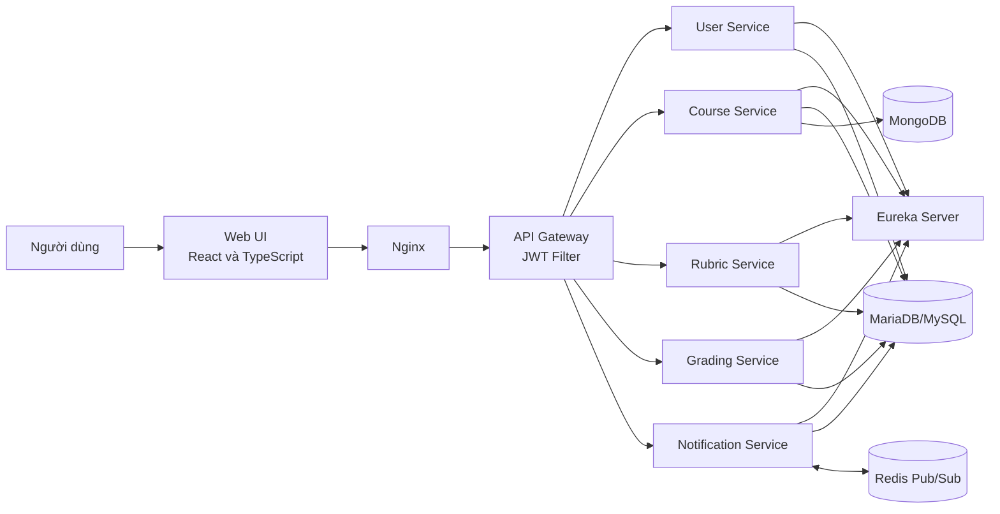
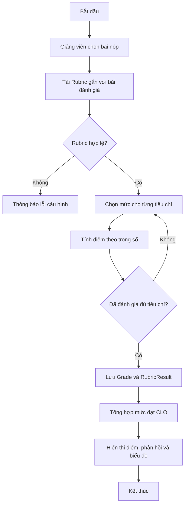
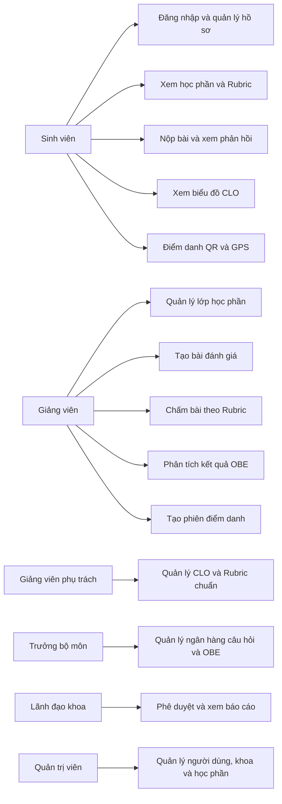
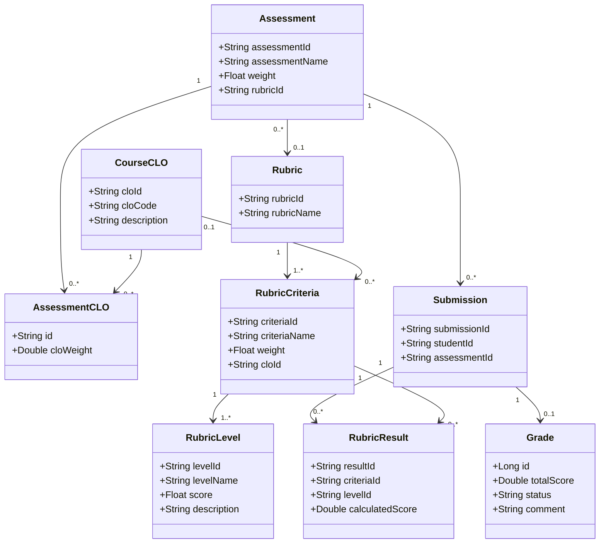
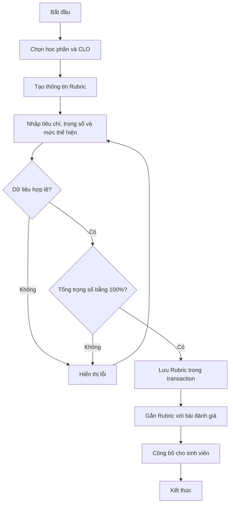
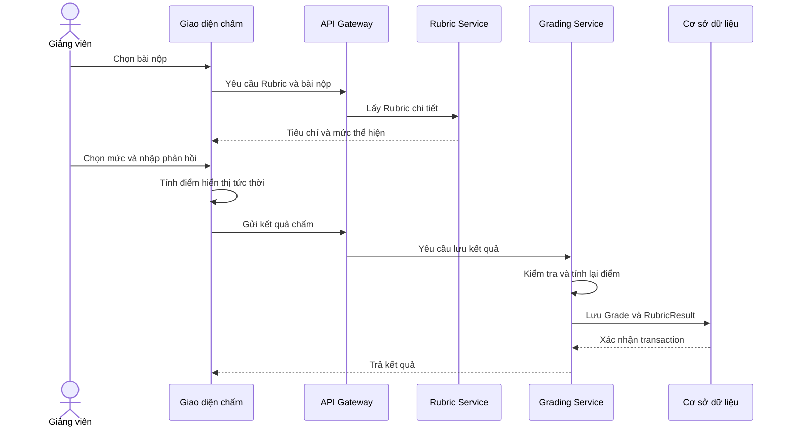

# CHƯƠNG 3. GIẢI PHÁP CHO BÀI TOÁN/VẤN ĐỀ/MÔ HÌNH

Chương này trình bày bài toán, giải pháp và quá trình hiện thực hệ thống quản lý học tập hỗ trợ đánh giá theo Rubric gắn với chuẩn đầu ra. Đề tài thuộc hướng **xây dựng ứng dụng phần mềm có yếu tố nghiên cứu ứng dụng**. Vì vậy, nội dung tập trung vào mô hình hóa nghiệp vụ, lựa chọn phương pháp xử lý, thiết kế kiến trúc, phân tích chức năng và đánh giá giải pháp triển khai. Các thuật toán được sử dụng là thuật toán xử lý nghiệp vụ và tổng hợp dữ liệu; đề tài không đề xuất thuật toán tối ưu như ACO và không sử dụng trí tuệ nhân tạo hoặc học máy.

## 3.1. Phát biểu mô hình/bài toán trong đề tài

### 3.1.1. Bối cảnh của bài toán

Trong đào tạo đại học theo tiếp cận chuẩn đầu ra (Outcome-Based Education – OBE), kết quả đánh giá không chỉ được thể hiện bằng một điểm tổng kết mà còn phải cung cấp bằng chứng về mức độ đạt chuẩn đầu ra học phần (Course Learning Outcome – CLO) của người học. Mỗi hoạt động đánh giá cần được liên kết với một hoặc nhiều CLO; kết quả phải có khả năng truy nguyên từ bài làm, tiêu chí, mức thể hiện đến chuẩn đầu ra tương ứng. Dữ liệu này là cơ sở để người học điều chỉnh phương pháp học tập, giảng viên cải tiến hoạt động giảng dạy và đơn vị quản lý thực hiện bảo đảm chất lượng.

Trong thực tế, giảng viên thường quản lý điểm bằng bảng tính hoặc nhiều công cụ rời rạc. Tiêu chí chấm, phản hồi, bài nộp và dữ liệu chuẩn đầu ra không được tổ chức trong một mô hình thống nhất. Giảng viên phải tính trọng số và tổng hợp điểm thủ công; sinh viên chủ yếu nhận được điểm cuối cùng mà khó xác định điểm mạnh, điểm yếu theo từng tiêu chí; bộ môn và khoa thiếu dữ liệu có cấu trúc để theo dõi mức đạt CLO.

Do đó, vấn đề cần giải quyết không chỉ là xây dựng một website quản lý khóa học, mà là xây dựng một cơ chế đánh giá có cấu trúc, minh bạch và truy nguyên được, đồng thời tích hợp cơ chế đó vào quy trình quản lý học phần.

### 3.1.2. Cơ sở thực tiễn từ khảo sát

Khảo sát được thực hiện bằng Google Forms kết hợp phỏng vấn trực tiếp tại Khoa Công nghệ Thông tin, Trường Đại học Nông Lâm Thành phố Hồ Chí Minh, vào ngày 02 tháng 02 năm 2026. Đối tượng khảo sát gồm giảng viên đang giảng dạy các học phần lý thuyết hoặc thực hành và sinh viên từ năm thứ nhất đến năm thứ tư.

Kết quả khảo sát giảng viên cho thấy 83,3% người tham gia sử dụng Excel hoặc Google Sheets để quản lý điểm; 10% sử dụng chức năng chấm điểm cơ bản trên LMS; 6,7% sử dụng sổ cá nhân hoặc phương thức khác. Có 90% ý kiến cho rằng việc tính trọng số và tổng hợp điểm từ nhiều tiêu chí tốn thời gian; 76% gặp khó khăn khi thống kê quá trình học tập; 65% có nhu cầu sử dụng ngân hàng câu hỏi có cấu trúc. Đồng thời, 95% giảng viên đồng ý về sự cần thiết của công cụ tự động hóa tính điểm và 80% quan tâm đến báo cáo năng lực theo chuẩn đầu ra.

Đối với sinh viên, 80,6% cho biết chỉ biết sơ lược hoặc hoàn toàn không biết căn cứ hình thành điểm số; chỉ 19,4% nắm rõ kết quả theo từng tiêu chí. Có 32,3% không nhận được phản hồi ngoài điểm số cuối cùng và 35,5% chủ yếu nhận phản hồi trực tiếp trên lớp. Có 83,9% mong muốn xem kết quả bằng biểu đồ năng lực và 96,8% cho rằng cần được xem Rubric trước khi nộp bài. Đối với điểm danh bằng mã QR, 87,1% có thái độ tích cực hoặc chấp nhận được, trong khi 12,9% lo ngại các trường hợp mạng yếu, thiết bị hết pin hoặc lỗi định vị.

Kết quả trên cho thấy ba nhu cầu chính: số hóa Rubric và tự động hóa tính điểm; công khai tiêu chí, lưu trữ phản hồi và trực quan hóa kết quả; tích hợp dữ liệu đánh giá với CLO, học phần và quá trình chuyên cần.

> **Lưu ý cần hiệu chỉnh trước khi nộp khóa luận:** cỡ mẫu đang được ghi là 20 giảng viên và 50 sinh viên, nhưng các tỷ lệ 83,3%/6,7% và 80,6%/19,4% không tương thích với bước phần trăm của hai cỡ mẫu này. Cần kiểm tra số phiếu hợp lệ cho từng câu hỏi trên Google Forms và trình bày kết quả theo dạng `n (%)`.

### 3.1.3. Phát biểu bài toán bằng ngôn ngữ tự nhiên

Bài toán của đề tài được phát biểu như sau:

> Xây dựng hệ thống quản lý học tập hỗ trợ thiết kế và công bố Rubric, liên kết từng tiêu chí đánh giá với CLO, cho phép giảng viên chấm bài theo mức thể hiện, tự động tổng hợp điểm theo trọng số, lưu phản hồi có cấu trúc, trực quan hóa kết quả cho sinh viên và tổng hợp mức đạt chuẩn đầu ra cho giảng viên, bộ môn và khoa.

Hệ thống cần phục vụ nhiều nhóm người dùng gồm sinh viên, giảng viên, giảng viên phụ trách học phần, trưởng bộ môn, lãnh đạo khoa và quản trị viên. Mỗi nhóm chỉ được truy cập chức năng và dữ liệu phù hợp với trách nhiệm của mình.

Đầu vào của bài toán gồm thông tin người dùng và vai trò; học phần và lớp học phần; CLO; bài đánh giá; Rubric gồm tiêu chí, trọng số, mức thể hiện và mô tả; bài nộp; mức Rubric do giảng viên lựa chọn; nhận xét; dữ liệu phiên điểm danh.

Đầu ra của bài toán gồm điểm theo từng tiêu chí; điểm tổng của bài đánh giá; phản hồi chi tiết; mức đạt CLO của từng sinh viên; phân bố mức đạt của lớp; biểu đồ năng lực; báo cáo điểm danh và dữ liệu phục vụ quản lý đào tạo.

### 3.1.4. Mô hình toán học của bài toán đánh giá

Đề tài sử dụng Rubric phân tích, trong đó bài làm được đánh giá độc lập theo nhiều tiêu chí. Một Rubric được biểu diễn bởi:

\[
R=\{C_1,C_2,\ldots,C_n\}
\]

Mỗi tiêu chí được biểu diễn bởi:

\[
C_i=(name_i,w_i,clo_i,L_i)
\]

Trong đó, \(name_i\) là tên tiêu chí; \(w_i\) là trọng số; \(clo_i\) là chuẩn đầu ra được tiêu chí đo lường; \(L_i\) là tập mức thể hiện. Mỗi mức \(L_{ij}\) gồm tên mức, mô tả và điểm \(q_{ij}\).

Các trọng số phải thỏa mãn:

\[
w_i\geq0,\qquad \sum_{i=1}^{n}w_i=100\%
\]

Với sinh viên \(s\), bài đánh giá \(a\), nếu giảng viên chọn mức có điểm \(q_{sai}\) cho tiêu chí \(C_i\), trọng số được chuẩn hóa về đoạn \([0,1]\):

\[
\bar{w}_i=
\begin{cases}
w_i/100, & w_i>1\\
w_i, & 0\leq w_i\leq1
\end{cases}
\]

Điểm đóng góp của tiêu chí và điểm tổng của bài đánh giá được tính bởi:

\[
r_{sai}=q_{sai}\bar{w}_i
\]

\[
S_{sa}=\sum_{i=1}^{n}r_{sai}
\]

Khi điểm tối đa giữa các tiêu chí không đồng nhất, điểm chuẩn hóa của bài đánh giá là:

\[
N_{sa}=\frac{\sum_{i=1}^{n}r_{sai}}
{\sum_{i=1}^{n}q_i^{max}\bar{w}_i}\times100
\]

Gọi \(I_{ac}\) là tập tiêu chí của bài đánh giá \(a\) gắn với CLO \(c\). Mức đạt CLO trên một bài đánh giá được xác định bởi:

\[
A_{sac}=\frac{\sum_{i\in I_{ac}}r_{sai}}
{\sum_{i\in I_{ac}}q_i^{max}\bar{w}_i}\times100
\]

Nếu CLO được đo bởi nhiều bài đánh giá và \(v_{ac}\) là trọng số đóng góp của bài \(a\), mức đạt tích lũy của sinh viên đối với CLO được tính bằng trung bình có trọng số:

\[
P_{sc}=\frac{\sum_{a\in A_c}A_{sac}v_{ac}}
{\sum_{a\in A_c}v_{ac}}
\]

Giá trị \(P_{sc}\) nằm trên thang 0–100. Ngưỡng đạt chính thức phải do chương trình đào tạo quy định; hệ thống chỉ thực hiện ngưỡng được cấu hình.

### 3.1.5. Các yêu cầu và ràng buộc

Giải pháp phải đáp ứng các yêu cầu sau:

1. Tự động hóa phép tính điểm theo trọng số và cho kết quả xác định.
2. Cho phép truy nguyên từ điểm CLO đến bài đánh giá, tiêu chí và mức Rubric.
3. Công khai Rubric trước khi sinh viên thực hiện nhiệm vụ đánh giá.
4. Lưu trữ phản hồi và cho phép sinh viên tra cứu sau khi chấm.
5. Phân quyền theo vai trò và bảo vệ dữ liệu điểm.
6. Có khả năng mở rộng chức năng và triển khai trên môi trường máy chủ.

Các ràng buộc nghiệp vụ chính gồm: mã CLO không trùng; tiêu chí thuộc một Rubric xác định; trọng số không âm; tổng trọng số của Rubric hoàn chỉnh bằng 100%; mức được chọn phải thuộc tiêu chí tương ứng; chỉ sinh viên thuộc lớp học phần mới được nộp bài hoặc điểm danh; chỉ người có thẩm quyền được tạo Rubric, chấm hoặc sửa điểm.

## 3.2. Giải pháp cụ thể để giải quyết mô hình/bài toán

### 3.2.1. Phân tích và lựa chọn hướng giải quyết

Đề tài lựa chọn Rubric phân tích thay cho phương pháp chỉ nhập một điểm tổng. Rubric phân tích phù hợp vì kết quả theo từng tiêu chí cung cấp phản hồi chi tiết, cho phép liên kết tiêu chí với CLO và có thể tổng hợp tự động bằng công thức xác định trước. So với Rubric tổng thể, phương pháp này cần nhiều dữ liệu hơn nhưng đáp ứng tốt hơn yêu cầu minh bạch và truy nguyên.

Về kiến trúc, hệ thống được thiết kế theo microservice thay cho một ứng dụng nguyên khối. Các miền người dùng, học phần, Rubric, chấm điểm và thông báo được tách thành dịch vụ riêng. Lựa chọn này phù hợp với phạm vi chức năng lớn và nhu cầu triển khai độc lập từng thành phần. Nhược điểm là phát sinh độ phức tạp trong giao tiếp liên dịch vụ, xác thực, giám sát và duy trì tính nhất quán dữ liệu. Để giảm các hạn chế này, hệ thống sử dụng API Gateway làm điểm truy cập thống nhất, Eureka để khám phá dịch vụ, JWT để xác thực và transaction trong phạm vi từng dịch vụ.

Đề tài không lựa chọn ACO hoặc thuật toán tối ưu tương tự vì bài toán không yêu cầu tìm đường đi, tối ưu lịch hoặc tìm nghiệm trong không gian tổ hợp. Bản chất bài toán là quản lý dữ liệu có cấu trúc và thực hiện các quy tắc nghiệp vụ xác định.

### 3.2.2. Kiến trúc tổng thể của hệ thống

Người dùng thao tác trên giao diện web React. Yêu cầu được chuyển qua Nginx đến API Gateway. Gateway kiểm tra JWT và định tuyến đến dịch vụ tương ứng. Các dịch vụ đăng ký với Eureka. MariaDB/MySQL lưu dữ liệu nghiệp vụ có cấu trúc; MongoDB hỗ trợ dữ liệu hội thoại; Redis hỗ trợ phát–nhận thông báo thời gian thực. Toàn bộ thành phần được đóng gói bằng Docker.



**Hình 3.1. Sơ đồ kiến trúc tổng thể của hệ thống LMS hỗ trợ đánh giá theo Rubric**

Các thành phần có trách nhiệm như sau:

- **User Service:** đăng nhập, JWT, OAuth2, quản lý người dùng và vai trò.
- **Course Service:** học phần, lớp học phần, bài đánh giá, bài nộp, CLO, OBE, ngân hàng câu hỏi, nhóm học tập và điểm danh.
- **Rubric Service:** quản lý Rubric, tiêu chí, mức thể hiện và liên kết CLO.
- **Grading Service:** lưu điểm tổng, kết quả từng tiêu chí và phản hồi.
- **Notification Service:** lưu trữ và phân phối thông báo.
- **API Gateway:** xác thực và định tuyến yêu cầu đến dịch vụ nội bộ.
- **Eureka Server:** đăng ký và khám phá địa chỉ dịch vụ.

### 3.2.3. Thiết kế các giải pháp thành phần

#### a) Giải pháp số hóa Rubric

Dữ liệu Rubric được tổ chức theo ba tầng `Rubric → RubricCriteria → RubricLevel`. Mỗi tiêu chí có tên, trọng số và mã CLO; mỗi mức thể hiện có tên, điểm và mô tả. Khi cập nhật ma trận, hệ thống đồng bộ toàn bộ cấu trúc trong một transaction. Nếu một thao tác thất bại, dữ liệu được rollback để tránh trạng thái chỉ lưu một phần.

#### b) Giải pháp chấm điểm và phản hồi

Giảng viên chọn một mức thể hiện cho từng tiêu chí. Giao diện hiển thị điểm có trọng số tức thời, sau đó gửi điểm tổng, mức được chọn và điểm từng tiêu chí đến Grading Service. Hệ thống lưu một bản ghi `Grade` cho kết quả tổng và nhiều bản ghi `RubricResult` cho kết quả chi tiết. Nhận xét chung và thư viện nhận xét mẫu giúp giảm thao tác lặp lại.

Về nguyên tắc an toàn, Grading Service cần tính lại điểm từ Rubric thay vì tin cậy hoàn toàn `totalScore` do trình duyệt gửi. Cách này ngăn việc sửa request ở phía máy khách và bảo đảm một nguồn tính toán thống nhất.

#### c) Giải pháp tổng hợp OBE

Hệ thống liên kết bài đánh giá với CLO thông qua `AssessmentCLO` và liên kết tiêu chí với CLO thông qua `RubricCriteria`. Chỉ các bài có trạng thái đã chấm được đưa vào phép tổng hợp. Điểm tiêu chí được chuẩn hóa theo điểm tối đa, nhân với trọng số bài đánh giá và tổng hợp cho từng CLO. Ở cấp lớp học phần, hệ thống phân bố kết quả theo các khoảng 0–40, 40–70 và 70–100 để hỗ trợ phân tích.

Véc-tơ năng lực của sinh viên được biểu diễn bởi:

\[
\mathbf{P}_s=(P_{s1},P_{s2},\ldots,P_{sm})
\]

Mỗi phần tử là mức đạt một CLO. Véc-tơ này được hiển thị bằng biểu đồ radar và luôn đi kèm số liệu chi tiết để tránh diễn giải chỉ dựa trên hình dạng biểu đồ.

#### d) Giải pháp điểm danh QR kết hợp GPS

Mỗi phiên điểm danh có mã phiên, token ngẫu nhiên, thời gian bắt đầu, thời gian kết thúc, tọa độ lớp và bán kính cho phép. Khi sinh viên quét QR, hệ thống kiểm tra token, trạng thái phiên, lớp học phần, tình trạng điểm danh lặp và tọa độ hiện tại.

Khoảng cách được tính bằng công thức Haversine:

\[
a=\sin^2\left(\frac{\Delta\varphi}{2}\right)
+\cos(\varphi_1)\cos(\varphi_2)
\sin^2\left(\frac{\Delta\lambda}{2}\right)
\]

\[
d=2R\operatorname{atan2}(\sqrt{a},\sqrt{1-a})
\]

Trong đó \(R=6.371.000\) m. Điểm danh được chấp nhận khi \(d\leq r\), với \(r\) là bán kính cấu hình và thời điểm yêu cầu còn trong khoảng hiệu lực. QR và GPS không chứng minh tuyệt đối sự hiện diện, vì vậy hệ thống lưu thêm thời gian, IP, trình duyệt và khoảng cách để hỗ trợ hậu kiểm; giảng viên có thể xử lý trường hợp thiết bị hoặc mạng gặp sự cố.

#### e) Giải pháp xác thực và phân quyền

Hệ thống sử dụng JWT theo cơ chế không trạng thái. Sau khi đăng nhập, access token được gửi kèm yêu cầu. API Gateway kiểm tra token trước khi định tuyến và chuyển định danh đã xác thực đến dịch vụ nội bộ. Quyền truy cập được phân theo vai trò. Khóa bí mật được truyền qua biến môi trường; khi triển khai thực tế, giao tiếp công khai phải sử dụng HTTPS.

### 3.2.4. Thuật toán xử lý chính

Quy trình tổng quát của chức năng đánh giá theo Rubric được thể hiện trong Hình 3.2.



**Hình 3.2. Sơ đồ thuật toán chấm điểm và tổng hợp kết quả theo Rubric**

Thuật toán đồng bộ ma trận Rubric được mô tả như sau:

```text
Thuật toán 3.1: Đồng bộ ma trận Rubric
Đầu vào: rubricId, rubricInfo, criteria[], descriptors[]
Đầu ra: Rubric đã được lưu

1. Tìm Rubric theo rubricId; nếu không tồn tại thì tạo mới.
2. Khởi tạo danh sách newCriteria rỗng.
3. Với mỗi criterionRequest:
   3.1. Tìm tiêu chí theo ID; nếu không có thì tạo mới.
   3.2. Cập nhật tên, trọng số, CLO và liên kết Rubric.
   3.3. Với mỗi levelRequest của tiêu chí:
        a. Tạo hoặc cập nhật mức thể hiện.
        b. Nếu thiếu dữ liệu, tìm descriptor bằng khóa
           (criterionId, levelId) để bổ sung.
        c. Thêm mức vào danh sách mức mới.
   3.4. Thay tập mức cũ bằng tập mức mới.
   3.5. Thêm tiêu chí vào newCriteria.
4. Thay tập tiêu chí cũ của Rubric bằng newCriteria.
5. Kiểm tra ràng buộc và lưu trong transaction.
6. Nếu có lỗi thì rollback; ngược lại trả về Rubric.
```

Với \(n\) tiêu chí, trung bình \(m\) mức và \(k\) descriptor, cách tìm descriptor tuyến tính có độ phức tạp xấu nhất \(O(nmk)\). Nếu lập bảng băm theo khóa `(criterionId, levelId)`, độ phức tạp kỳ vọng giảm còn \(O(nm+k)\).

Thuật toán tính điểm được mô tả như sau:

```text
Thuật toán 3.2: Tính điểm bài đánh giá theo Rubric
Đầu vào: Rubric R, tập mức được chọn Q, thông tin bài nộp
Đầu ra: điểm tổng S và kết quả theo tiêu chí

1. Kiểm tra Rubric tồn tại và thuộc bài đánh giá.
2. Đặt S = 0 và Results = rỗng.
3. Với mỗi tiêu chí C_i:
   3.1. Kiểm tra mức L_ij được chọn là hợp lệ.
   3.2. Chuẩn hóa trọng số w_i về [0,1].
   3.3. Tính r_i = q_ij × w_i.
   3.4. Cộng r_i vào S.
   3.5. Thêm (criteriaId, levelId, r_i) vào Results.
4. Kiểm tra S không vượt điểm tối đa.
5. Lưu Grade và thay thế RubricResult trong transaction.
6. Trả về S và Results.
```

Thuật toán có độ phức tạp thời gian \(O(n)\) và bộ nhớ \(O(n)\), với \(n\) là số tiêu chí.

## 3.3. Hiện thực giải pháp

### 3.3.1. Mô tả chương trình

#### a) Môi trường và công nghệ hiện thực

Hệ thống được xây dựng theo mô hình ứng dụng web client–server phân tán. Môi trường hiện thực chính gồm:

- Frontend: React 19, TypeScript, Vite, Redux Toolkit, Axios, Recharts/Chart.js và STOMP.
- Backend: Java, Spring Boot, Spring Web, Spring Data JPA, Spring Security, OpenFeign và Spring Cloud Netflix Eureka.
- Cơ sở dữ liệu: MariaDB 10.4 tương thích MySQL, MongoDB 7 và Redis 7.
- Triển khai: Docker Engine, Docker Compose, Nginx và Ubuntu 22.04/24.04.
- Xác thực: JWT và Google OAuth2.
- Giao tiếp thời gian thực: WebSocket/STOMP và Redis Pub/Sub.

Máy chủ triển khai được đề xuất có tối thiểu 4 CPU, 8 GB RAM và đủ dung lượng lưu trữ cho cơ sở dữ liệu, tệp bài nộp và bản sao lưu. Các thông số máy phát triển và máy kiểm thử thực tế cần được ghi theo thiết bị đã sử dụng, không sử dụng cấu hình đề xuất thay cho dữ liệu thực nghiệm.

> **Thông tin cần bổ sung trong bản nộp:** CPU, RAM, hệ điều hành và phiên bản Docker của máy đã dùng để chạy kiểm thử; số lượng bản ghi hoặc người dùng trong bộ dữ liệu thử nghiệm.

#### b) Tổ chức chương trình

Frontend cung cấp giao diện riêng cho quản trị viên, lãnh đạo khoa, trưởng bộ môn, giảng viên phụ trách, giảng viên và sinh viên. Các yêu cầu REST được gửi đến API Gateway theo tiền tố `/api/v1`. Gateway định tuyến đến năm dịch vụ nghiệp vụ. Mỗi dịch vụ tổ chức theo các lớp controller, service, repository, DTO và entity.

Các container được kết nối qua mạng nội bộ `lms-network`. Chỉ cổng Nginx của frontend được công bố ra ngoài; cơ sở dữ liệu, Eureka và dịch vụ Java không công bố trực tiếp. Dữ liệu MariaDB, MongoDB và Redis được lưu trong Docker volume để không bị mất khi cập nhật container.

### 3.3.2. Phân tích các chức năng hệ thống

#### a) Sơ đồ use case tổng quát

Các tác nhân chính và chức năng tương ứng được mô tả trong Hình 3.3.



**Hình 3.3. Sơ đồ use case tổng quát của hệ thống**

#### b) Sơ đồ lớp của miền đánh giá

Sơ đồ lớp tập trung vào các đối tượng cốt lõi của bài toán Rubric–CLO.



**Hình 3.4. Sơ đồ lớp của miền đánh giá Rubric–CLO**

#### c) Activity diagram của quy trình xây dựng Rubric



**Hình 3.5. Activity diagram của quy trình xây dựng và công bố Rubric**

#### d) Sequence diagram của quy trình chấm điểm



**Hình 3.6. Sequence diagram của quy trình chấm điểm theo Rubric**

#### e) Các vấn đề gặp phải và giải pháp xử lý

Trong quá trình hiện thực, nhóm xác định các vấn đề chính sau:

1. **Dữ liệu Rubric có cấu trúc phân cấp phức tạp.** Khi cập nhật riêng lẻ có thể tạo tiêu chí hoặc mức bị thiếu liên kết. Giải pháp là đồng bộ toàn bộ ma trận trong transaction và thiết lập quan hệ cha–con rõ ràng.
2. **Điểm được tạo từ nhiều tiêu chí và trọng số.** Việc tính ở nhiều nơi dễ gây sai khác. Giải pháp là chuẩn hóa công thức, hiển thị tạm thời ở frontend và tính lại tại backend trước khi lưu chính thức.
3. **Dữ liệu OBE nằm ở nhiều bảng.** Việc tổng hợp trực tiếp dễ đếm trùng hoặc chia cho không. Giải pháp là chỉ sử dụng bài đã chấm, chuẩn hóa theo điểm tối đa, dùng `NULLIF` khi chia và nhóm dữ liệu theo sinh viên, bài đánh giá và CLO.
4. **Giao tiếp trong hệ thống phân tán có thể thất bại.** Giải pháp là định tuyến qua Gateway, khám phá dịch vụ bằng Eureka, tách thông báo khỏi giao dịch nghiệp vụ chính và ghi log lỗi liên dịch vụ.
5. **Thông tin định danh có thể bị giả mạo từ trình duyệt.** Giải pháp là kiểm tra JWT tại Gateway, chuyển tiếp token trong lời gọi nội bộ và không tin cậy header định danh do máy khách tự tạo.
6. **GPS có sai số và có thể bị giả lập.** Giải pháp là kết hợp token QR, thời gian, bán kính, IP, trình duyệt, kiểm tra điểm danh lặp và cơ chế hậu kiểm của giảng viên.
7. **Dữ liệu cơ sở phải được bảo toàn khi triển khai lại.** Giải pháp là sử dụng Docker volume và không xóa volume trong quy trình cập nhật thông thường.

### 3.3.3. Phân tích và đánh giá kết quả đề xuất triển khai

#### a) Mức độ đáp ứng yêu cầu

Giải pháp hiện thực đã hình thành đầy đủ các thành phần nền tảng để giải quyết bài toán: quản lý người dùng và vai trò; quản lý học phần; thiết kế Rubric; liên kết tiêu chí với CLO; chấm điểm và lưu kết quả từng tiêu chí; quản lý bài nộp; tổng hợp OBE; trực quan hóa kết quả; điểm danh QR–GPS; thông báo và triển khai container.

So với quy trình bảng tính, giải pháp mang lại ba cải tiến chính. Thứ nhất, cấu trúc Rubric và công thức trọng số được lưu thống nhất, giảm thao tác tổng hợp thủ công. Thứ hai, sinh viên có thể xem tiêu chí và phản hồi chi tiết thay vì chỉ nhận điểm tổng. Thứ ba, dữ liệu đánh giá được liên kết với CLO để tạo báo cáo có khả năng truy nguyên.

#### b) Đánh giá về kiến trúc triển khai

Mô hình Docker Compose triển khai Nginx, API Gateway, Eureka, năm dịch vụ nghiệp vụ, MariaDB, MongoDB và Redis trên cùng một mạng nội bộ. Chỉ Nginx công bố cổng web ra máy chủ. Cách triển khai này đơn giản hóa cài đặt và cô lập dịch vụ, phù hợp cho giai đoạn thử nghiệm hoặc triển khai trong phạm vi khoa.

Các Docker volume giúp giữ dữ liệu khi container được xây dựng lại. Cấu hình nhạy cảm như mật khẩu cơ sở dữ liệu và JWT secret được truyền qua tệp môi trường. Khi triển khai chính thức cần bổ sung HTTPS, sao lưu định kỳ, giám sát log, health check đầy đủ và cơ chế khôi phục sau sự cố.

#### c) Tiêu chí kiểm thử và đánh giá

Để đánh giá khách quan, hệ thống cần được kiểm thử theo ba nhóm:

1. **Kiểm thử đúng chức năng:** tạo Rubric; kiểm tra tổng trọng số; chấm và cập nhật điểm; xem phản hồi; tổng hợp CLO; phân quyền; tạo và quét QR.
2. **Kiểm thử đúng tính toán:** xây dựng bộ dữ liệu có kết quả tính tay, sau đó so sánh điểm tiêu chí, điểm tổng và mức đạt CLO với kết quả hệ thống. Sai số kỳ vọng bằng 0, ngoại trừ sai số làm tròn được quy định trước.
3. **Kiểm thử hiệu năng và khả dụng:** đo thời gian phản hồi trung vị, P95, tỷ lệ lỗi khi tăng số người dùng đồng thời; khảo sát người dùng bằng thang Likert hoặc System Usability Scale.

Các câu hỏi đánh giá được đề xuất gồm:

- RQ1: Hệ thống có giảm thời gian tổng hợp điểm so với bảng tính hay không?
- RQ2: Kết quả tính tự động có trùng với kết quả tính tay không?
- RQ3: Công khai Rubric và biểu đồ năng lực có giúp sinh viên hiểu rõ căn cứ hình thành điểm không?
- RQ4: Hệ thống có đáp ứng tải sử dụng dự kiến trong phạm vi khoa không?

Chỉ nên đưa số liệu thời gian, độ chính xác hoặc mức hài lòng vào khóa luận sau khi thực sự tiến hành thử nghiệm nhiều lần. Mỗi kết quả phải ghi rõ cấu hình máy, cỡ mẫu, số lần chạy, dữ liệu đầu vào, giá trị trung bình, độ lệch chuẩn và tỷ lệ lỗi. Không áp dụng bảng so sánh ACO hoặc so sánh các thuật toán tối ưu vì đề tài thuộc hướng xây dựng ứng dụng phần mềm.

#### d) Hạn chế và hướng hoàn thiện

Hiện tại, giao diện có thực hiện phép tính điểm có trọng số trước khi gửi kết quả đến Grading Service. Dịch vụ chấm lưu `totalScore` từ request và trong mã nguồn vẫn còn phương thức thử nghiệm sinh điểm ngẫu nhiên. Trước khi nghiệm thu, cần chuyển toàn bộ phép tính quyết định sang backend, xác thực Rubric và loại bỏ hoặc cô lập phương thức thử nghiệm.

Kiến trúc hiện tại chủ yếu bảo đảm transaction trong từng dịch vụ, chưa cung cấp transaction phân tán. Các nghiệp vụ liên dịch vụ quan trọng cần được thiết kế theo hướng bất đồng bộ, idempotent và có cơ chế thử lại. Ngoài ra, cần bổ sung kiểm thử tự động, giám sát tập trung, nhật ký kiểm toán thay đổi điểm và đánh giá độ nhất quán giữa nhiều người chấm nếu Rubric được sử dụng cho quyết định học vụ quan trọng.

Tóm lại, giải pháp đề xuất phù hợp với bài toán quản lý đánh giá theo Rubric–CLO và đáp ứng định hướng xây dựng ứng dụng phần mềm của đề tài. Kiến trúc và mô hình dữ liệu đã tạo được nền tảng cho việc số hóa quy trình đánh giá, tăng tính minh bạch và hỗ trợ tổng hợp OBE. Các nội dung kiểm thử định lượng và hiệu chỉnh phía backend là công việc cần hoàn tất để chứng minh đầy đủ hiệu quả của hệ thống trong môi trường triển khai thực tế.

## Tài liệu tham khảo sử dụng trong chương

[1] ASEAN University Network, *Guide to AUN-QA Assessment at Programme Level, Version 4.0*, 2020. https://www.aunsec.org/application/files/2816/7290/3752/Guide_to_AUN-QA_Assessment_at_Programme_Level_Version_4.0_4.pdf

[2] J. Jonsson and G. Svingby, “The use of scoring rubrics: Reliability, validity and educational consequences,” *Educational Research Review*, vol. 2, no. 2, pp. 130–144, 2007. https://doi.org/10.1016/j.edurev.2007.05.002

[3] D. Allen and K. Tanner, “Rubrics: Tools for making learning goals and evaluation criteria explicit for both teachers and learners,” *CBE—Life Sciences Education*, vol. 5, no. 3, pp. 197–203, 2006. https://doi.org/10.1187/cbe.06-06-0168

[4] M. Oakleaf, “Using rubrics to assess information literacy: An examination of methodology and interrater reliability,” *Journal of the American Society for Information Science and Technology*, vol. 60, no. 5, pp. 969–983, 2009. https://doi.org/10.1002/asi.21030
