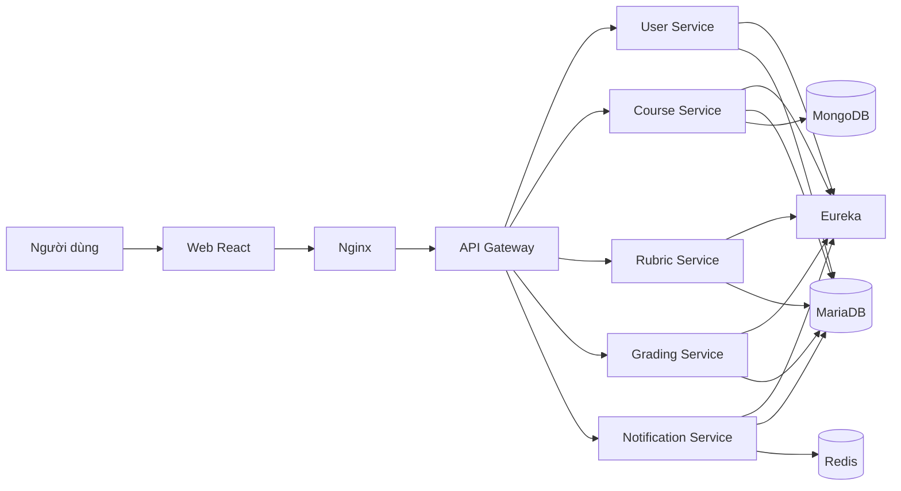
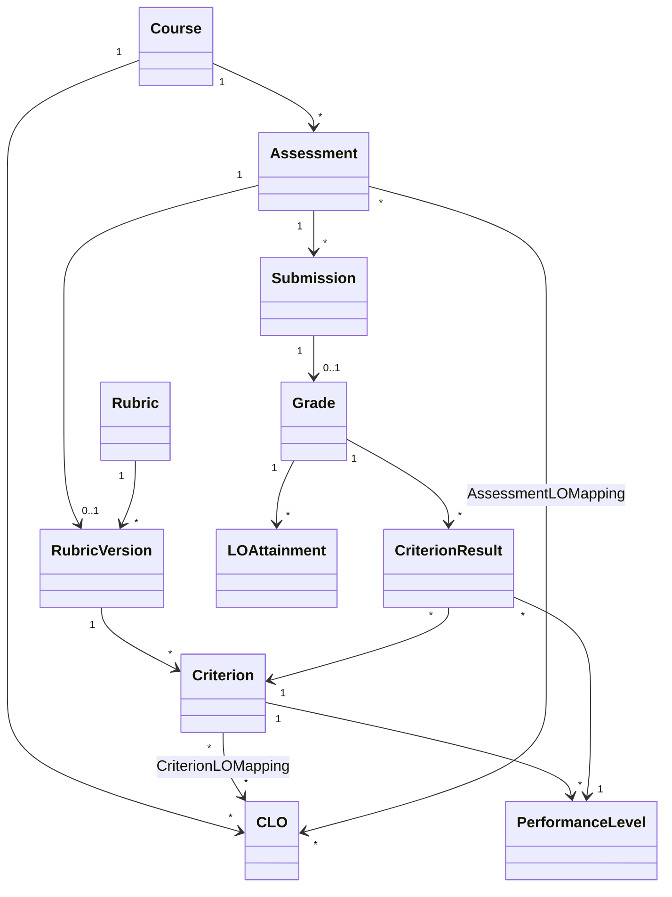
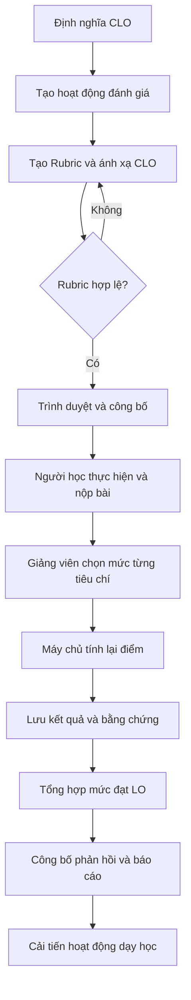
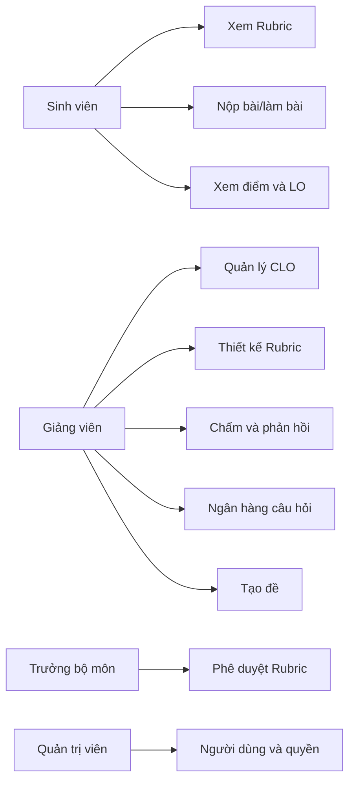
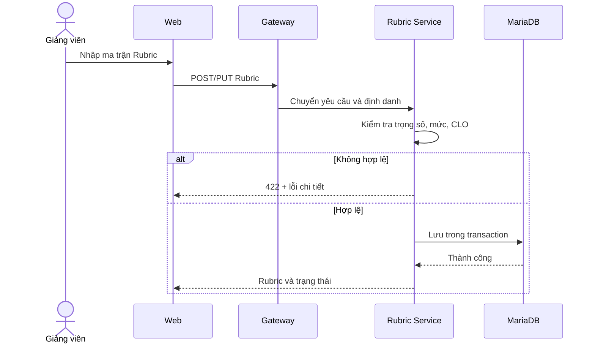
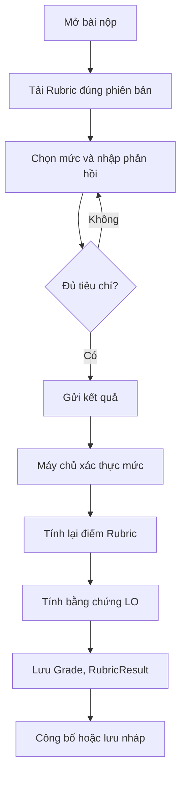

# CHƯƠNG 3. GIẢI PHÁP KIẾN TRÚC VÀ THIẾT KẾ HỆ THỐNG

Chương này trình bày phương pháp xây dựng giải pháp, cơ sở lý thuyết và cơ sở khoa học của phép đánh giá, sau đó đề xuất kiến trúc và thiết kế chi tiết cho hệ thống quản lý học tập hỗ trợ đánh giá theo Rubric gắn với chuẩn đầu ra. Trọng tâm của chương là chuyển Rubric từ một bảng hướng dẫn chấm tĩnh thành mô hình dữ liệu có thể lưu trữ, kiểm tra, tái sử dụng và xử lý tự động; đồng thời hình thành chuỗi bằng chứng có thể truy nguyên từ bài làm đến tiêu chí, mức thể hiện và chuẩn đầu ra học phần.

## 3.1. Phương pháp thực hiện

### 3.1.1. Phương pháp thu thập và phân tích tài liệu

Nghiên cứu sử dụng phương pháp nghiên cứu tài liệu để xác lập thuật ngữ, yêu cầu sư phạm và nguyên tắc thiết kế. Nguồn tài liệu được ưu tiên theo thứ tự: (i) bài báo khoa học đã qua bình duyệt; (ii) tiêu chuẩn và tài liệu của tổ chức chuyên môn; (iii) tài liệu chính thức của nền tảng và công nghệ; (iv) tài liệu kỹ thuật của dự án. Từ khóa tra cứu gồm: *social constructionism*, *constructive alignment*, *analytic rubric*, *learning outcome assessment*, *outcome-based education*, *microservices*, *advanced grading* và *question bank*.

Quy trình xử lý tài liệu gồm bốn bước: xác định câu hỏi cần làm rõ; tìm và sàng lọc nguồn; đọc, mã hóa nội dung theo nhóm chủ đề; đối chiếu kết luận của tài liệu với yêu cầu và mã nguồn của hệ thống. Các nhận định về Moodle, Rubric, OBE và kiến trúc không được suy rộng vượt quá nội dung của nguồn. Các thông số riêng của đề tài chỉ được ghi nhận khi có bằng chứng từ cấu hình, mô hình dữ liệu hoặc mã nguồn.

### 3.1.2. Phương pháp xác định yêu cầu

Yêu cầu hệ thống được xác định bằng cách phân tích quy trình nghiệp vụ đánh giá học phần và kiểm tra chéo với các chức năng đã có trong dự án. Dòng nghiệp vụ được truy vết theo chuỗi:

**Chuẩn đầu ra → hoạt động đánh giá → Rubric → tiêu chí → mức thể hiện → bài nộp → kết quả tiêu chí → mức đạt chuẩn đầu ra.**

Đề tài không sử dụng các tỷ lệ khảo sát chưa có tập dữ liệu gốc hoặc biên bản khảo sát kèm theo. Khi chưa có dữ liệu khảo sát có thể kiểm chứng, nhu cầu thực tiễn được trình bày dưới dạng yêu cầu nghiệp vụ, không trình bày dưới dạng kết quả thống kê. Nếu khảo sát được bổ sung sau, cần công bố tối thiểu: bảng hỏi, thời gian và địa điểm, phương pháp chọn mẫu, số phiếu phát ra, số phiếu hợp lệ và bảng dữ liệu ẩn danh; kết quả phải ghi theo dạng \(n\) và tỷ lệ phần trăm.

### 3.1.3. Phương pháp phát triển hệ thống theo hướng Agile

Giải pháp được phát triển lặp và tăng trưởng theo các nguyên tắc Agile: ưu tiên phần mềm hoạt động được, tiếp nhận thay đổi yêu cầu và bàn giao chức năng theo các vòng ngắn [1]. Mỗi vòng phát triển gồm:

1. Chọn nhóm yêu cầu có giá trị cao trong danh sách công việc.
2. Làm rõ tiêu chí chấp nhận và dữ liệu liên quan.
3. Thiết kế giao diện, API và mô hình dữ liệu.
4. Hiện thực một lát cắt chức năng từ giao diện đến dịch vụ và cơ sở dữ liệu.
5. Kiểm thử, trình diễn và ghi nhận phản hồi.
6. Cập nhật danh sách công việc cho vòng tiếp theo.

Các lát cắt được ưu tiên theo quan hệ phụ thuộc: quản lý người dùng và học phần; quản lý CLO; xây dựng và phê duyệt Rubric; bài đánh giá và bài nộp; chấm theo Rubric; tổng hợp LO; ngân hàng câu hỏi và báo cáo. Cách tổ chức này cho phép kiểm tra sớm chuỗi dữ liệu đánh giá, thay vì hoàn thành riêng lẻ từng tầng kỹ thuật nhưng chưa tạo được quy trình nghiệp vụ hoàn chỉnh.

### 3.1.4. Phương pháp mô hình hóa và kiểm chứng

UML được sử dụng để mô tả tác nhân, trường hợp sử dụng, lớp miền, hoạt động và tương tác. Mô hình dữ liệu được đối chiếu với entity, repository và quan hệ thực tế trong mã nguồn. Kiểm thử được xây dựng từ quy tắc nghiệp vụ và các thuộc tính chất lượng phù hợp với ISO/IEC 25010:2023 [14], tập trung vào tính đúng chức năng, an toàn, độ tin cậy, khả năng sử dụng và khả năng bảo trì.

### 3.1.5. Bảng từ viết tắt và ký hiệu

**Bảng 3.1. Danh mục từ viết tắt**

| Từ viết tắt | Thuật ngữ tiếng Anh | Ý nghĩa sử dụng trong đề tài |
|---|---|---|
| API | Application Programming Interface | Giao diện lập trình ứng dụng |
| CLO | Course Learning Outcome | Chuẩn đầu ra học phần |
| CSDL | Database | Cơ sở dữ liệu |
| JWT | JSON Web Token | Mã thông báo dùng cho xác thực |
| LMS | Learning Management System | Hệ thống quản lý học tập |
| LO | Learning Outcome | Chuẩn đầu ra/kết quả học tập |
| NoSQL | Not Only SQL | Nhóm cơ sở dữ liệu phi quan hệ |
| OBE | Outcome-Based Education | Giáo dục dựa trên chuẩn đầu ra |
| PLO | Program Learning Outcome | Chuẩn đầu ra chương trình đào tạo |
| QR | Quick Response | Mã phản hồi nhanh |
| RBAC | Role-Based Access Control | Kiểm soát truy cập theo vai trò |
| REST | Representational State Transfer | Kiểu thiết kế dịch vụ web |
| SQL | Structured Query Language | Ngôn ngữ truy vấn có cấu trúc |
| UML | Unified Modeling Language | Ngôn ngữ mô hình hóa thống nhất |

**Bảng 3.2. Ký hiệu dùng trong các công thức**

| Ký hiệu | Diễn giải |
|---|---|
| \(s\) | Người học |
| \(a\) | Hoạt động/bài đánh giá |
| \(i\) | Tiêu chí Rubric |
| \(c\) | Chuẩn đầu ra |
| \(x_{sai}\) | Điểm mức thể hiện người học \(s\) đạt ở tiêu chí \(i\) của bài \(a\) |
| \(x^{min}_{ai},x^{max}_{ai}\) | Điểm nhỏ nhất và lớn nhất của tiêu chí |
| \(p_{sai}\) | Phần trăm đạt đã chuẩn hóa của một tiêu chí |
| \(w_{ai}\) | Trọng số của tiêu chí trong Rubric |
| \(m_{aic}\) | Hệ số ánh xạ tiêu chí \(i\) tới LO \(c\) |
| \(v_{ac}\) | Trọng số của bài đánh giá \(a\) đối với LO \(c\) |
| \(A_{sac}\) | Phần trăm đạt LO \(c\) trong một bài đánh giá |
| \(P_{sc}\) | Phần trăm đạt tích lũy của người học đối với LO \(c\) |
| \(\tau_c\) | Ngưỡng đạt LO \(c\) do đơn vị đào tạo cấu hình |

## 3.2. Cơ sở lý thuyết

### 3.2.1. Triết lý kiến tạo xã hội và LMS

Moodle công bố thiết kế của nền tảng được định hướng bởi sư phạm kiến tạo xã hội. Theo cách tiếp cận này, người học chủ động kiến tạo tri thức khi tương tác với môi trường, tạo ra sản phẩm và cùng cộng đồng hình thành ý nghĩa chung [2]. Vì vậy, LMS không chỉ là nơi phân phối tài liệu mà cần hỗ trợ hoạt động, sản phẩm học tập, trao đổi và phản hồi.

Đối với đề tài, đánh giá không đứng ngoài quá trình học tập. Rubric được công bố trước hoạt động giúp người học nhận biết tiêu chuẩn chất lượng; phản hồi theo từng tiêu chí giúp người học điều chỉnh sản phẩm; dữ liệu theo LO giúp giảng viên điều chỉnh dạy học. Cách tổ chức này phù hợp với nguyên lý liên kết kiến tạo của Biggs: chuẩn đầu ra, hoạt động dạy–học và đánh giá phải được thiết kế đồng bộ [3].

### 3.2.2. Chuẩn đầu ra và giáo dục dựa trên chuẩn đầu ra

LO mô tả điều người học có thể biểu hiện sau một quá trình học tập. Trong phạm vi một học phần, LO được gọi là CLO; ở cấp chương trình, LO được gọi là PLO. OBE tổ chức chương trình, hoạt động dạy học và đánh giá xoay quanh các kết quả cần đạt. Đánh giá trực tiếp cần tạo bằng chứng đủ rõ để xác định mức đạt và cung cấp dữ liệu cho cải tiến liên tục [4], [5].

Một CLO tốt cần có hành động quan sát hoặc đo lường được, nội dung thực hiện và điều kiện/mức chất lượng khi cần. Trong hệ thống, mỗi CLO phải có mã duy nhất, mô tả, ngưỡng đạt, quan hệ với học phần và quan hệ ánh xạ tới tiêu chí hoặc câu hỏi. Không nên suy ra mức đạt CLO chỉ từ điểm tổng học phần vì một điểm tổng có thể che khuất sự khác biệt giữa các năng lực thành phần.

### 3.2.3. Khái niệm và cấu trúc Rubric

Rubric là hướng dẫn chấm gồm tập tiêu chí và mô tả các mức chất lượng tương ứng. Hai thành phần cốt lõi là tiêu chí chỉ ra nội dung cần xem xét và mô tả mức thể hiện chỉ ra chất lượng ở từng mức [6]. Tiêu chí rõ, tập trung và mô tả mức có thể phân biệt là điều kiện quan trọng để Rubric cung cấp thông tin đánh giá có chất lượng [7].

Rubric tổng thể đưa ra một nhận định chung cho toàn bộ sản phẩm. Rubric phân tích đánh giá độc lập từng tiêu chí. Đề tài chọn Rubric phân tích vì cần lưu kết quả ở mức tiêu chí và ánh xạ tiêu chí với CLO.

**Bảng 3.3. So sánh Rubric tổng thể và Rubric phân tích**

| Tiêu chí so sánh | Rubric tổng thể | Rubric phân tích | Lựa chọn của đề tài |
|---|---|---|---|
| Đơn vị chấm | Toàn bộ sản phẩm | Từng tiêu chí | Rubric phân tích |
| Tốc độ chấm | Nhanh hơn | Cần nhiều thao tác hơn | Chấp nhận để tăng chi tiết |
| Mức độ phản hồi | Khái quát | Cụ thể theo điểm mạnh/yếu | Phù hợp yêu cầu phản hồi |
| Khả năng ánh xạ CLO | Hạn chế | Ánh xạ theo tiêu chí | Phù hợp OBE |
| Khả năng tự động tổng hợp | Có nhưng ít chi tiết | Có, theo trọng số | Phù hợp thuật toán LO |
| Khả năng tái sử dụng dữ liệu | Thấp hơn | Cao hơn khi được số hóa | Phù hợp mục tiêu đề tài |

### 3.2.4. Rubric như một mô hình dữ liệu số

Tài liệu Moodle cho thấy phương pháp chấm nâng cao có thể lưu định nghĩa Rubric trong cơ sở dữ liệu, tính điểm thô rồi quy đổi sang thang điểm của hoạt động và tái sử dụng biểu mẫu [8]. Kế thừa nguyên tắc đó, đề tài biểu diễn:

\[
Rubric=(Metadata,\ Criteria,\ Levels,\ Mappings,\ Version,\ Status)
\tag{3.1}
\]

Trong đó `Metadata` chứa tên, mô tả, học phần và người tạo; `Criteria` chứa tiêu chí và trọng số; `Levels` chứa tên mức, điểm và mô tả; `Mappings` chứa liên kết tới LO; `Version` bảo toàn phiên bản đã dùng để chấm; `Status` điều khiển vòng đời nháp, chờ duyệt, được duyệt, bị từ chối và ngừng sử dụng.

Khi Rubric đã phát sinh kết quả chấm, hệ thống không sửa đè cấu trúc làm thay đổi bằng chứng quá khứ. Thay đổi phải tạo phiên bản mới hoặc lưu ảnh chụp cấu hình tại thời điểm chấm. Đây là yêu cầu quan trọng để bảo đảm khả năng truy nguyên.

## 3.3. Cơ sở khoa học của tính điểm, trọng số và xây dựng đề

### 3.3.1. Nguyên tắc thiết kế phép tính

Phép tính phải thỏa mãn năm nguyên tắc:

1. **Xác định:** cùng dữ liệu đầu vào phải cho cùng kết quả.
2. **Chuẩn hóa:** so sánh được các tiêu chí có thang điểm khác nhau.
3. **Không tính lặp:** một minh chứng ánh xạ nhiều LO phải có hệ số phân bổ rõ.
4. **Truy nguyên:** mỗi giá trị tổng hợp truy ngược được về mức Rubric đã chọn.
5. **Cấu hình:** ngưỡng đạt do chương trình đào tạo quyết định, không mã hóa cứng.

### 3.3.2. Tính điểm bài đánh giá theo Rubric

Với tiêu chí \(i\) của bài đánh giá \(a\), phần trăm đạt được chuẩn hóa:

\[
p_{sai}=
\begin{cases}
\dfrac{x_{sai}-x^{min}_{ai}}{x^{max}_{ai}-x^{min}_{ai}}\times100,
& x^{max}_{ai}>x^{min}_{ai}\\
0, & x^{max}_{ai}=x^{min}_{ai}
\end{cases}
\tag{3.2}
\]

Việc trừ điểm nhỏ nhất cần được cấu hình. Nếu thang mức quy định mức thấp nhất tương đương 0% thì dùng Công thức (3.2). Nếu điểm mức là số điểm đóng góp trực tiếp, có thể dùng \(p_{sai}=x_{sai}/x^{max}_{ai}\times100\). Hệ thống phải lưu `scoringMode` để không trộn hai cách hiểu.

Gọi \(\bar w_{ai}=w_{ai}/\sum_jw_{aj}\), điểm phần trăm của bài đánh giá là:

\[
S_{sa}=\sum_i\bar w_{ai}p_{sai}
\tag{3.3}
\]

Điểm trên thang \(G_a\), ví dụ thang 10, được quy đổi:

\[
Grade_{sa}=\frac{S_{sa}}{100}\times G_a
\tag{3.4}
\]

Công thức này tổng quát hóa cách Moodle quy đổi điểm thô của Rubric sang điểm tối đa của hoạt động [8].

### 3.3.3. Thuật toán quy đổi điểm Rubric sang phần trăm đạt chuẩn đầu ra

Một tiêu chí có thể đo một hoặc nhiều LO. Hệ số \(m_{aic}\) biểu diễn phần đóng góp của tiêu chí \(i\) cho LO \(c\), với \(m_{aic}\ge0\). Nếu một tiêu chí ánh xạ tới nhiều LO thì phải quy định \(\sum_cm_{aic}=1\), trừ khi cơ sở đào tạo chủ động cho phép dùng cùng minh chứng cho nhiều LO và chấp nhận tính lặp.

Mức đạt LO \(c\) trong bài đánh giá \(a\):

\[
A_{sac}=
\frac{\sum_{i\in I_{ac}}w_{ai}m_{aic}p_{sai}}
{\sum_{i\in I_{ac}}w_{ai}m_{aic}}
\tag{3.5}
\]

Mức đạt tích lũy qua các bài đánh giá:

\[
P_{sc}=
\frac{\sum_{a\in E_{sc}}v_{ac}A_{sac}}
{\sum_{a\in E_{sc}}v_{ac}}
\tag{3.6}
\]

Trong đó \(E_{sc}\) chỉ gồm các bài đã có bằng chứng hợp lệ của người học \(s\) cho LO \(c\). Kết luận đạt:

\[
Result_{sc}=
\begin{cases}
Đạt, & P_{sc}\ge\tau_c\\
Chưa\ đạt, & P_{sc}<\tau_c\\
Chưa\ đủ\ dữ\ liệu, & E_{sc}=\varnothing
\end{cases}
\tag{3.7}
\]

Không được tự động biến “chưa có dữ liệu” thành 0 điểm, trừ khi quy chế xác định vắng/nộp thiếu là 0. Phân biệt hai trạng thái này tránh làm sai báo cáo năng lực.

**Thuật toán 3.1. LO Mapping Algorithm**

```text
Đầu vào:
  rubricVersion, các mức đã chọn, mapping tiêu chí–LO,
  trọng số tiêu chí, trọng số bài–LO, ngưỡng đạt
Đầu ra:
  điểm bài, phần trăm đạt từng LO, trạng thái và chuỗi truy nguyên

1. Kiểm tra Rubric ở phiên bản hợp lệ và thuộc bài đánh giá.
2. Kiểm tra mọi tiêu chí bắt buộc đã có mức được chọn.
3. Với từng tiêu chí:
   3.1. Xác thực level thuộc đúng criterion.
   3.2. Chuẩn hóa điểm level thành p_sai theo scoringMode.
   3.3. Lưu kết quả tiêu chí và phiên bản Rubric.
4. Tính điểm bài theo Công thức (3.3) và (3.4).
5. Với từng LO được Rubric bao phủ:
   5.1. Lấy các tiêu chí ánh xạ tới LO.
   5.2. Tính A_sac theo Công thức (3.5).
   5.3. Lưu tử số, mẫu số và các evidenceId.
6. Với từng LO của học phần:
   6.1. Lấy các bài đã công bố kết quả và có bằng chứng hợp lệ.
   6.2. Tính P_sc theo Công thức (3.6).
   6.3. So sánh với ngưỡng theo Công thức (3.7).
7. Trả điểm, trạng thái LO và đường dẫn truy nguyên.
```

Độ phức tạp thời gian là \(O(r+e)\), với \(r\) là số kết quả tiêu chí và \(e\) là số cạnh ánh xạ tiêu chí–LO. Thuật toán là phép tổng hợp có trọng số xác định, không phải thuật toán AI hoặc thuật toán tối ưu.

### 3.3.4. Cơ sở xây dựng ma trận đề thi

Đề thi phải bao phủ LO và mức độ nhận thức dự kiến, thay vì chỉ lấy ngẫu nhiên đủ số câu. Ma trận đề được biểu diễn:

\[
B=\{b_{cdt}\}
\tag{3.8}
\]

Trong đó \(b_{cdt}\) là số câu cần chọn cho LO \(c\), độ khó \(d\) và loại câu \(t\). Tổng số câu yêu cầu:

\[
N=\sum_c\sum_d\sum_tb_{cdt}
\tag{3.9}
\]

Mỗi câu hỏi cần có tối thiểu: nội dung, loại câu, độ khó, điểm, đáp án hoặc hướng dẫn chấm, LO liên quan, học phần, trạng thái duyệt và lịch sử phiên bản. Các nhãn LO và độ khó là dữ liệu bắt buộc nếu ô tương ứng xuất hiện trong ma trận đề.

### 3.3.5. Xử lý trường hợp ngân hàng câu hỏi bị thiếu

Gọi \(Q_{cdt}\) là tập câu hợp lệ có thể dùng cho một ô ma trận. Số câu thiếu:

\[
\Delta_{cdt}=\max(0,b_{cdt}-|Q_{cdt}|)
\tag{3.10}
\]

Trước khi sinh đề, hệ thống tính toàn bộ \(\Delta_{cdt}\). Nếu có ô bị thiếu, mặc định hệ thống dừng sinh đề và trả báo cáo thiếu theo LO, độ khó và loại câu. Không được âm thầm lặp câu hoặc lấy câu ngoài LO vì sẽ phá vỡ độ bao phủ của đề.

Chế độ phân bổ thay thế chỉ được thực hiện khi giảng viên bật cấu hình và xác nhận phương án. Thứ tự ưu tiên là: cùng LO, cùng loại câu, độ khó lân cận; sau đó mới xét cùng LO và loại câu tương đương. Mọi thay đổi phải được lưu trong nhật ký ma trận. Chọn câu thực hiện không hoàn lại; `randomSeed` và danh sách `questionId` được lưu để tái lập đề khi cần.

**Thuật toán 3.2. Sinh đề có kiểm tra thiếu câu hỏi**

```text
1. Đọc ma trận B và tập câu hỏi đã duyệt.
2. Nhóm câu theo khóa (LO, độ khó, loại câu).
3. Tính delta cho từng ô.
4. Nếu tồn tại delta > 0:
   4.1. Trả báo cáo thiếu; dừng ở chế độ nghiêm ngặt.
   4.2. Nếu cho phép thay thế, đề xuất phương án và chờ xác nhận.
5. Với mỗi ô đủ dữ liệu, xáo trộn có seed và lấy b_cdt câu không hoàn lại.
6. Kiểm tra trùng questionId, tổng số câu, tổng điểm và độ bao phủ LO.
7. Lưu phiên bản đề, ma trận thực tế, seed và nhật ký thay thế.
```

Độ phức tạp kỳ vọng là \(O(q+N)\), với \(q\) là số câu hợp lệ được lập chỉ mục. Nếu sử dụng ràng buộc phức tạp như loại trừ đồng xuất hiện, cân bằng chủ đề và nhiều phiên bản có độ tương đương, bài toán cần bộ giải ràng buộc; nội dung đó nằm ngoài phạm vi hiện tại.

## 3.4. Lựa chọn kiến trúc

### 3.4.1. Tiêu chí lựa chọn

Kiến trúc được đánh giá theo: mức phù hợp miền nghiệp vụ, khả năng tách triển khai, mở rộng, cô lập lỗi, nhất quán dữ liệu, độ phức tạp vận hành và mức phù hợp với mã nguồn hiện có. Lewis và Fowler mô tả microservice là cách tổ chức ứng dụng thành các dịch vụ nhỏ theo năng lực nghiệp vụ, có thể triển khai độc lập và giao tiếp qua cơ chế nhẹ [9].

**Bảng 3.4. So sánh các phương án kiến trúc**

| Tiêu chí | Nguyên khối | Nguyên khối mô-đun | Microservice |
|---|---|---|---|
| Triển khai ban đầu | Đơn giản | Đơn giản | Phức tạp hơn |
| Tách miền nghiệp vụ | Thấp nếu thiết kế kém | Tốt trong cùng ứng dụng | Tốt theo dịch vụ |
| Triển khai độc lập | Không | Hạn chế | Có |
| Giao dịch nhất quán | Thuận lợi | Thuận lợi | Khó hơn giữa dịch vụ |
| Quan sát và xử lý lỗi | Đơn giản hơn | Trung bình | Cần hạ tầng bổ sung |
| Phù hợp nhóm nhỏ | Cao | Cao | Chỉ phù hợp khi có lý do rõ |
| Phù hợp mã nguồn đề tài | Thấp | Trung bình | Cao vì dự án đã tách dịch vụ |

Đề tài chọn microservice vì hệ thống hiện đã phân tách các miền người dùng, học phần, Rubric, chấm điểm và thông báo; mỗi miền có mô hình dữ liệu và nhịp thay đổi khác nhau. Lựa chọn này không được xem là mặc nhiên tốt hơn. Chi phí phải chấp nhận gồm độ trễ mạng, lỗi từng phần, cấu hình phân tán và khó bảo đảm giao dịch xuyên dịch vụ. Giải pháp giảm thiểu là API Gateway, khám phá dịch vụ, timeout, kiểm soát lỗi, nhật ký liên kết và quy tắc “mỗi dịch vụ sở hữu dữ liệu của mình”.

### 3.4.2. Kiến trúc tổng thể



**Hình 3.1. Kiến trúc tổng thể của hệ thống**

`User Service` quản lý danh tính và vai trò. `Course Service` quản lý học phần, lớp học phần, CLO, hoạt động đánh giá, bài nộp, ngân hàng câu hỏi và đề thi. `Rubric Service` quản lý Rubric, tiêu chí, mức thể hiện, ánh xạ và phê duyệt. `Grading Service` quản lý kết quả chấm, phản hồi và dữ liệu tiêu chí. `Notification Service` lưu và phân phối thông báo. API Gateway là điểm truy cập thống nhất, phù hợp với vai trò định tuyến và thực hiện các mối quan tâm dùng chung như bảo mật [10].

### 3.4.3. Phân tích theo What–Where–When–Why

**Bảng 3.5. Trách nhiệm kiến trúc theo What–Where–When–Why**

| Thành phần | What – xử lý gì | Where – đặt ở đâu | When – được gọi khi nào | Why – lý do tách |
|---|---|---|---|---|
| API Gateway | Xác thực sơ bộ, định tuyến | Biên hệ thống | Mọi yêu cầu API | Một điểm vào, giảm lặp chính sách |
| User Service | Người dùng, vai trò, token | Miền danh tính | Đăng nhập và kiểm tra người dùng | Dữ liệu nhạy cảm, dùng chung |
| Course Service | Học phần, CLO, bài đánh giá, câu hỏi | Miền đào tạo | Tổ chức và thực hiện học phần | Tập trung ngữ cảnh học vụ |
| Rubric Service | Rubric, tiêu chí, mức, phiên bản | Miền đánh giá | Tạo, duyệt, lấy Rubric | Rubric là cấu phần trung tâm |
| Grading Service | Điểm, kết quả tiêu chí, phản hồi | Miền chấm điểm | Chấm, công bố, xem kết quả | Cô lập dữ liệu điểm và phép tính |
| Notification Service | Thông báo và phân phối thời gian thực | Miền giao tiếp | Sau sự kiện nghiệp vụ | Không làm nghẽn giao dịch chính |
| MariaDB | Dữ liệu có quan hệ và ràng buộc | Theo dịch vụ/miền | Giao dịch nghiệp vụ | Phù hợp tính toàn vẹn quan hệ |
| MongoDB | Câu hỏi/đề có cấu trúc linh hoạt | Course Service | Quản lý ngân hàng và đề | Thuận lợi với document và mảng |
| Redis | Kênh phát–nhận thông báo | Notification Service | Khi phát sự kiện thời gian thực | Giảm ghép nối bên gửi–nhận |

## 3.5. Công nghệ nền tảng

### 3.5.1. Nguyên tắc lựa chọn công nghệ

Công nghệ được chọn theo bốn tiêu chí: tương thích kiến trúc, năng lực của nhóm, hệ sinh thái thư viện và khả năng đóng gói triển khai. Phiên bản chính thức phải lấy từ `pom.xml`, `package.json` và `compose.yaml` tại thời điểm đóng gói khóa luận; không ghi phiên bản theo trí nhớ hoặc theo phiên bản mới nhất trên Internet.

**Bảng 3.6. Công nghệ và lý do sử dụng**

| Công nghệ | What | Where | When | Why |
|---|---|---|---|---|
| React, TypeScript | Giao diện kiểu thành phần, kiểm tra kiểu | Front-end | Tương tác người dùng | Phù hợp SPA và mô hình giao diện hiện có |
| Spring Boot | REST API và nghiệp vụ | Các dịch vụ backend | Khi xử lý yêu cầu | Hệ sinh thái Java, DI, JPA, Security |
| Spring Cloud Gateway | Định tuyến và bộ lọc chung | API Gateway | Trước khi vào dịch vụ | Điểm vào thống nhất [10] |
| Eureka | Đăng ký/khám phá dịch vụ | Hạ tầng nội bộ | Khi dịch vụ khởi động và gọi nhau | Tránh cấu hình địa chỉ cố định |
| OpenFeign | HTTP client khai báo | Giữa các dịch vụ | Khi cần dữ liệu miền khác | Giảm mã gọi REST lặp |
| MariaDB/MySQL | Dữ liệu quan hệ | Các miền nghiệp vụ | Giao dịch CRUD | Ràng buộc và transaction |
| MongoDB | Dữ liệu document | Câu hỏi và đề thi | Đọc/ghi cấu trúc linh hoạt | Document có thể chứa mảng và tài liệu con [11] |
| Redis | Pub/Sub | Thông báo | Phân phối thời gian thực | Giảm ghép nối |
| JWT, OAuth2 | Xác thực/ủy quyền | Gateway và User Service | Sau đăng nhập | Hỗ trợ API không trạng thái |
| Docker Compose | Đóng gói và kết nối dịch vụ | Môi trường triển khai | Phát triển và triển khai | Tái lập môi trường |

### 3.5.2. Lựa chọn mô hình lưu trữ

**Bảng 3.7. So sánh lưu trữ quan hệ và document**

| Đặc điểm dữ liệu | MariaDB | MongoDB | Quyết định |
|---|---|---|---|
| Người dùng, học phần, ghi danh | Quan hệ rõ, cần khóa ngoại | Không có lợi thế rõ | MariaDB |
| Rubric, tiêu chí, mức | Quan hệ và vòng đời cần kiểm soát | Có thể nhúng nhưng khó liên kết hiện trạng | MariaDB |
| Điểm và kết quả tiêu chí | Cần transaction và truy nguyên | Có thể dùng nhưng không cần thiết | MariaDB |
| Câu hỏi với phương án trả lời | Cấu trúc thay đổi theo loại câu | Document/mảng phù hợp | MongoDB |
| Đề thi và danh sách câu | Có thể quan hệ hóa | Document phù hợp đọc trọn gói | MongoDB |
| Thông báo thời gian thực | Không phải kho chính | Không thay thế message broker | MariaDB + Redis |

MongoDB cho phép tài liệu chứa mảng và tài liệu con, giảm nhu cầu join khi dữ liệu thường được đọc cùng nhau [11]. Tuy nhiên, không dùng NoSQL cho mọi dữ liệu. Quy tắc chọn kho dữ liệu dựa trên đặc tính truy cập và ràng buộc của từng miền.

## 3.6. Mô hình và quy trình giải quyết bài toán

### 3.6.1. Phát biểu lại bài toán

Từ các hạn chế đã nhận diện ở Chương 2, bài toán được phát biểu lại:

> Xây dựng giải pháp kiến trúc cho LMS trong đó đánh giá là cấu phần trung tâm; Rubric được số hóa thành mô hình dữ liệu có phiên bản; hoạt động chấm được tự động tính toán theo tiêu chí và trọng số; kết quả được ánh xạ thành phần trăm đạt LO có thể truy nguyên; dữ liệu được khai thác cho phản hồi, báo cáo và cải tiến theo OBE.

Đầu vào gồm người dùng và vai trò; học phần và lớp học phần; CLO; bài đánh giá; Rubric; tiêu chí, mức, trọng số và ánh xạ; bài nộp; lựa chọn mức; ngân hàng câu hỏi và ma trận đề. Đầu ra gồm điểm tiêu chí, điểm bài, phản hồi, phần trăm đạt LO, trạng thái đạt/chưa đạt/chưa đủ dữ liệu, đề thi hợp lệ và báo cáo thiếu câu hỏi.

### 3.6.2. Mô hình dữ liệu miền đánh giá



**Hình 3.2. Lược đồ lớp khái niệm của miền đánh giá**

Mô hình đề xuất bổ sung `RubricVersion`, `CriterionLOMapping` và `LOAttainmentEvidence`. Ba cấu trúc này cần thiết để: bảo toàn Rubric đã dùng; biểu diễn hệ số ánh xạ thay vì chỉ lưu một `cloId`; lưu tử số, mẫu số và nguồn bằng chứng của kết quả tổng hợp.

### 3.6.3. Quy trình nghiệp vụ tổng thể



**Hình 3.3. Quy trình giải quyết bài toán đánh giá theo Rubric**

### 3.6.4. Quy tắc toàn vẹn

- Tổng trọng số tiêu chí của Rubric được công bố phải bằng 100% trong sai số cho phép.
- Mỗi tiêu chí có ít nhất hai mức, điểm mức nằm trong miền hợp lệ và được sắp thứ tự.
- Mức được chọn phải thuộc đúng tiêu chí và đúng phiên bản Rubric.
- Rubric phải bao phủ ít nhất một CLO; hệ số ánh xạ không âm.
- Chỉ bài nộp thuộc đúng lớp học phần và người học mới được chấm.
- Chỉ vai trò được phân quyền mới được duyệt Rubric, chấm, sửa hoặc công bố điểm.
- Mọi lần sửa điểm sau công bố phải lưu người sửa, thời điểm, lý do, giá trị trước và sau.
- Phép tính chính thức phải thực hiện ở máy chủ; dữ liệu tổng điểm từ trình duyệt chỉ có giá trị hiển thị tạm.

## 3.7. Phân tích và thiết kế hệ thống

### 3.7.1. Tác nhân và trường hợp sử dụng

**Bảng 3.8. Danh mục tác nhân**

| Mã | Tác nhân | Trách nhiệm chính |
|---|---|---|
| ACT-01 | Sinh viên | Xem Rubric, nộp bài, làm bài thi, xem điểm và LO |
| ACT-02 | Giảng viên | Quản lý hoạt động, Rubric, câu hỏi, chấm và phản hồi |
| ACT-03 | Giảng viên phụ trách học phần | Điều phối nội dung, CLO và cấu hình đánh giá |
| ACT-04 | Trưởng bộ môn | Duyệt Rubric và theo dõi báo cáo theo bộ môn |
| ACT-05 | Lãnh đạo khoa | Theo dõi tổng hợp và chính sách đánh giá |
| ACT-06 | Quản trị viên | Quản lý tài khoản, vai trò và cấu hình hệ thống |
| ACT-07 | Dịch vụ thông báo | Gửi thông báo sau sự kiện nghiệp vụ |

**Bảng 3.9. Danh mục trường hợp sử dụng chính**

| Mã | Tên trường hợp sử dụng | Tác nhân chính | Kết quả |
|---|---|---|---|
| UC-01 | Quản lý CLO | ACT-02, ACT-03 | CLO hợp lệ của học phần |
| UC-02 | Tạo/chỉnh sửa Rubric | ACT-02 | Bản nháp Rubric có tiêu chí và mức |
| UC-03 | Ánh xạ tiêu chí với CLO | ACT-02, ACT-03 | Ma trận ánh xạ có hệ số |
| UC-04 | Phê duyệt Rubric | ACT-04, ACT-05 | Rubric được duyệt hoặc trả về |
| UC-05 | Công bố bài đánh giá | ACT-02 | Sinh viên xem yêu cầu và Rubric |
| UC-06 | Nộp bài | ACT-01 | Bài nộp có thời gian và phiên bản |
| UC-07 | Chấm theo Rubric | ACT-02 | Điểm bài và kết quả tiêu chí |
| UC-08 | Công bố phản hồi | ACT-02 | Sinh viên xem kết quả |
| UC-09 | Xem mức đạt LO | ACT-01, ACT-02 | Báo cáo cá nhân/lớp |
| UC-10 | Quản lý ngân hàng câu hỏi | ACT-02 | Câu hỏi được phân loại và duyệt |
| UC-11 | Tạo đề theo ma trận | ACT-02 | Đề hợp lệ hoặc báo cáo thiếu |
| UC-12 | Quản lý người dùng và quyền | ACT-06 | Tài khoản và quyền phù hợp |



**Hình 3.4. Lược đồ use case rút gọn theo tác nhân**

### 3.7.2. Thiết kế cơ sở dữ liệu quan hệ và NoSQL

**Bảng 3.10. Các bảng quan hệ cốt lõi**

| Bảng | Khóa chính | Nội dung | Quan hệ chính |
|---|---|---|---|
| `course_clo` | `clo_id` | CLO và ngưỡng đạt | Thuộc học phần |
| `assessment` | `assessment_id` | Hoạt động đánh giá | Thuộc lớp học phần |
| `assessment_clo` | `assessment_clo_id` | Trọng số bài–CLO | Nối assessment–CLO |
| `rubric` | `rubric_id` | Siêu dữ liệu và trạng thái | Có nhiều phiên bản |
| `rubric_version` | `version_id` | Ảnh cấu hình Rubric | Có nhiều criterion |
| `rubric_criteria` | `criteria_id` | Tiêu chí và trọng số | Thuộc version |
| `rubric_level` | `level_id` | Mức, điểm, mô tả | Thuộc criterion |
| `criterion_clo_map` | Khóa ghép | Hệ số tiêu chí–CLO | Nối criterion–CLO |
| `grades` | `id` | Điểm tổng và trạng thái | Theo submission |
| `rubric_results` | `result_id` | Mức chọn và điểm tiêu chí | Theo submission |
| `lo_attainment` | `attainment_id` | Kết quả LO đã tổng hợp | Theo student–CLO |
| `grade_audit` | `audit_id` | Lịch sử sửa điểm | Theo grade |

Trong MongoDB, `question` lưu nội dung, loại, độ khó, điểm, danh sách phương án, `cloIds`, trạng thái duyệt và phiên bản. `question_bank` lưu thông tin kho và danh sách tham chiếu câu hỏi. `assessment_paper` lưu ma trận dự kiến, danh sách câu được chọn, ma trận thực tế, `randomSeed` và nhật ký thay thế.

### 3.7.3. Đặc tả chức năng tạo và phê duyệt Rubric

**Bảng 3.11. Đặc tả UC-02 – Tạo/chỉnh sửa Rubric**

| Thuộc tính | Nội dung |
|---|---|
| Tiền điều kiện | Giảng viên đã đăng nhập, có quyền với học phần; CLO đã tồn tại |
| Kích hoạt | Giảng viên chọn tạo Rubric |
| Luồng chính | Nhập thông tin; tạo tiêu chí; tạo mức; gán trọng số và CLO; kiểm tra; lưu nháp hoặc gửi duyệt |
| Luồng thay thế | Tổng trọng số sai, thiếu mức, CLO không hợp lệ: hiển thị lỗi theo trường và không gửi duyệt |
| Hậu điều kiện | Rubric ở trạng thái `DRAFT` hoặc `PENDING`; lưu người tạo và thời điểm |
| Quy tắc | Rubric `APPROVED` đã dùng để chấm không bị sửa đè |



**Hình 3.5. Sequence diagram tạo Rubric**

### 3.7.4. Đặc tả chức năng chấm theo Rubric

**Bảng 3.12. Đặc tả UC-07 – Chấm theo Rubric**

| Thuộc tính | Nội dung |
|---|---|
| Tiền điều kiện | Bài nộp tồn tại; Rubric đã công bố; giảng viên có quyền chấm |
| Kích hoạt | Giảng viên mở bài nộp |
| Luồng chính | Tải Rubric; chọn mức; nhập nhận xét; xem điểm tạm; gửi; máy chủ xác thực và tính lại; lưu điểm, kết quả tiêu chí và bằng chứng LO |
| Luồng thay thế | Thiếu tiêu chí bắt buộc, Rubric sai phiên bản hoặc mức không thuộc tiêu chí: từ chối lưu |
| Hậu điều kiện | Điểm ở trạng thái nháp hoặc công bố; dữ liệu có thể truy nguyên |
| Quy tắc | Không tin cậy `totalScore` từ máy khách; cập nhật điểm và kết quả tiêu chí trong một transaction cục bộ |



**Hình 3.6. Activity diagram chấm theo Rubric**

### 3.7.5. Đặc tả chức năng báo cáo LO

**Bảng 3.13. Đặc tả UC-09 – Xem mức đạt LO**

| Thuộc tính | Nội dung |
|---|---|
| Tiền điều kiện | Có cấu hình ánh xạ và ít nhất một kết quả đã công bố |
| Kích hoạt | Người dùng mở báo cáo LO |
| Luồng chính | Kiểm tra phạm vi quyền; lấy evidence; tổng hợp theo Công thức (3.5)–(3.7); trả phần trăm, trạng thái và chi tiết |
| Luồng thay thế | Không có evidence: trả `Chưa đủ dữ liệu`, không trả 0 |
| Hậu điều kiện | Báo cáo không làm thay đổi điểm |
| Quy tắc | Sinh viên chỉ xem dữ liệu của mình; giảng viên xem lớp được phân công; quản lý xem phạm vi phụ trách |

### 3.7.6. Đặc tả chức năng tạo đề

**Bảng 3.14. Đặc tả UC-11 – Tạo đề theo ma trận**

| Thuộc tính | Nội dung |
|---|---|
| Tiền điều kiện | Ngân hàng có câu hỏi đã duyệt và gắn nhãn; ma trận đề hợp lệ |
| Kích hoạt | Giảng viên yêu cầu sinh đề |
| Luồng chính | Kiểm kê câu; phát hiện thiếu; chọn không hoàn lại; kiểm tra tổng số câu/điểm/LO; lưu phiên bản đề |
| Luồng thay thế | Thiếu câu: trả bảng thiếu hoặc đề xuất thay thế có xác nhận |
| Hậu điều kiện | Đề lưu được tái lập bằng seed và danh sách ID |
| Quy tắc | Không tự lặp câu, không tự đổi LO, không dùng câu chưa duyệt |

### 3.7.7. Xác thực, phân quyền và bảo vệ dữ liệu

Gateway xác minh token và chuyển định danh tới dịch vụ. Tuy nhiên, dịch vụ đích vẫn phải kiểm tra quyền trên tài nguyên, ví dụ giảng viên có được phân công lớp học phần hay không. RBAC được kết hợp với kiểm tra sở hữu/phạm vi. Mật khẩu được băm; bí mật JWT và khóa dịch vụ được lấy từ biến môi trường; giao tiếp bên ngoài sử dụng HTTPS; log không ghi token, mật khẩu hoặc toàn bộ nội dung nhạy cảm.

Các thao tác duyệt Rubric, sửa điểm, công bố điểm và thay thế ô ma trận đề phải có audit log. Dữ liệu hiển thị và xuất báo cáo được giới hạn theo vai trò. Sao lưu cần bao gồm cả MariaDB và MongoDB; khôi phục phải kiểm tra tính đồng bộ của định danh liên dịch vụ.

### 3.7.8. Đối chiếu với hiện trạng mã nguồn

**Bảng 3.15. Mức độ hiện thực của giải pháp tại thời điểm rà soát**

| Hạng mục | Hiện trạng | Khoảng trống cần hoàn thiện |
|---|---|---|
| Cấu trúc Rubric–criteria–level | Đã có entity và CRUD | Bổ sung phiên bản và validation tổng trọng số |
| Ánh xạ tiêu chí–CLO | Đang lưu `cloId` tại tiêu chí | Mở rộng bảng mapping có hệ số |
| Phê duyệt Rubric | Đã có trạng thái và luồng duyệt | Bổ sung audit đầy đủ |
| Lưu kết quả tiêu chí | Đã có `RubricResult` | Ràng buộc phiên bản và khóa ngoại logic |
| Tính điểm chính thức | Một luồng nhận `totalScore`; còn hàm mẫu dùng điểm ngẫu nhiên | Loại bỏ mã mẫu, tính lại hoàn toàn ở máy chủ |
| Tổng hợp LO | Có dữ liệu `AssessmentCLO` và dịch vụ OBE | Áp dụng Công thức (3.5)–(3.7), lưu evidence |
| Ngân hàng câu hỏi | Có câu hỏi, độ khó, CLO, import | Bổ sung duyệt, phiên bản và kiểm tra thiếu theo ô |
| Sinh đề | Có mô hình đề và xử lý bài thi | Bổ sung blueprint, seed, audit thay thế |
| Hạ tầng microservice | Gateway, Eureka, Docker Compose đã có | Bổ sung timeout, health check và tracing |

Bảng trên phân biệt rõ giải pháp thiết kế với phần đã hiện thực. Đặc biệt, hàm sinh điểm bằng `Math.random()` trong một luồng của `GradingService` chỉ là mã mẫu và không thể được dùng làm bằng chứng cho thuật toán chấm Rubric. Trước khi nghiệm thu, mã này phải được loại bỏ hoặc thay bằng Thuật toán 3.1.

## 3.8. Kiểm thử và tiêu chí đánh giá

### 3.8.1. Chiến lược kiểm thử

Kiểm thử được tổ chức theo các tầng: kiểm thử đơn vị cho công thức và quy tắc; kiểm thử tích hợp cho repository, transaction và API giữa dịch vụ; kiểm thử hợp đồng cho cấu trúc request/response; kiểm thử đầu cuối cho quy trình; kiểm thử bảo mật cho xác thực và phân quyền; kiểm thử khôi phục cho dữ liệu.

Không ghi “đã đạt” nếu chưa có log chạy, báo cáo hoặc bộ dữ liệu kiểm thử. Chương này quy định ca kiểm thử và tiêu chí chấp nhận; kết quả thực nghiệm, ảnh chụp và log nên trình bày ở chương kết quả hoặc phụ lục.

### 3.8.2. Ca kiểm thử cốt lõi

**Bảng 3.16. Danh mục ca kiểm thử**

| Mã | Ca kiểm thử | Dữ liệu/điều kiện | Kết quả mong đợi |
|---|---|---|---|
| TC-01 | Tổng trọng số bằng 100% | 4 tiêu chí, mỗi tiêu chí 25% | Cho phép gửi duyệt |
| TC-02 | Tổng trọng số sai | Tổng 90% hoặc 110% | Từ chối công bố |
| TC-03 | Mức không thuộc tiêu chí | `levelId` của tiêu chí khác | HTTP 422/400, không ghi dữ liệu |
| TC-04 | Thang điểm tiêu chí khác nhau | Các mức tối đa 4 và 10 | Chuẩn hóa đúng theo (3.2) |
| TC-05 | Một tiêu chí ánh xạ hai LO | Hệ số 0,6 và 0,4 | Phân bổ đúng, không tính lặp ngoài cấu hình |
| TC-06 | Chưa có bài được chấm | Không có evidence | Trạng thái “Chưa đủ dữ liệu” |
| TC-07 | Sửa request `totalScore` | Máy khách gửi tổng điểm giả | Máy chủ bỏ qua và tính lại |
| TC-08 | Sửa Rubric đã dùng | Rubric đã có Grade | Tạo version mới hoặc từ chối sửa đè |
| TC-09 | Thiếu câu trong một ô | Cần 5, chỉ có 3 | Báo thiếu 2, không sinh đề nghiêm ngặt |
| TC-10 | Chọn câu không hoàn lại | Đủ câu trong mọi ô | Không trùng ID trong đề |
| TC-11 | Tái lập đề | Cùng seed và snapshot ngân hàng | Cùng danh sách ID |
| TC-12 | Sinh viên xem điểm người khác | Token sinh viên A, resource B | HTTP 403 |
| TC-13 | Dịch vụ thông báo lỗi | Lưu điểm thành công, thông báo lỗi | Điểm không mất; có cơ chế thử lại/cảnh báo |
| TC-14 | Đồng thời hai lần lưu điểm | Hai request cùng version | Kiểm soát xung đột, không tạo kết quả kép |

### 3.8.3. Tiêu chí chấp nhận

- Sai số số học của phép quy đổi không vượt \(10^{-6}\) trước khi làm tròn.
- Mỗi điểm LO truy nguyên được tới bài đánh giá và kết quả tiêu chí.
- Không có Rubric được công bố khi vi phạm ràng buộc cấu trúc.
- Không sinh đề ở chế độ nghiêm ngặt khi bất kỳ ô ma trận nào thiếu câu.
- Người dùng ngoài phạm vi không truy cập được điểm hoặc bài nộp.
- Mọi thao tác thay đổi điểm sau công bố có audit log.
- API lỗi trả mã trạng thái và thông báo nhất quán; không làm lộ stack trace.
- Các dịch vụ chính có health check và dữ liệu có quy trình sao lưu/khôi phục.

## 3.9. Kết luận chương

Chương 3 đã xây dựng giải pháp theo hướng đặt đánh giá ở trung tâm kiến trúc LMS. Cơ sở lý thuyết kết nối kiến tạo xã hội, liên kết kiến tạo, Rubric phân tích và OBE. Trên cơ sở đó, chương đề xuất mô hình dữ liệu Rubric có phiên bản, thuật toán quy đổi kết quả tiêu chí thành phần trăm đạt LO, cơ chế xử lý thiếu câu hỏi khi sinh đề, kiến trúc microservice, lựa chọn lưu trữ quan hệ–document và thiết kế các chức năng chính.

Giải pháp giải quyết trực tiếp năm hạn chế đã nêu: đánh giá trở thành miền nghiệp vụ độc lập; mô hình đánh giá có tiêu chí, mức, trọng số và ngưỡng; Rubric được số hóa và tái sử dụng; phép tính được tự động hóa và kiểm chứng ở máy chủ; dữ liệu kết quả tạo thành hồ sơ LO có thể truy nguyên. Việc đối chiếu với mã nguồn cũng chỉ ra rõ phần đã có và phần cần hoàn thiện, tránh đồng nhất thiết kế đề xuất với kết quả đã triển khai.

## Tài liệu tham khảo sử dụng trong chương

[1] K. Beck và cộng sự, “Manifesto for Agile Software Development,” 2001. [Trực tuyến]. Địa chỉ: https://agilemanifesto.org/ và https://agilemanifesto.org/principles

[2] Moodle, “Philosophy,” *MoodleDocs*. [Trực tuyến]. Địa chỉ: https://docs.moodle.org/28/en/Philosophy

[3] J. Biggs, “Enhancing teaching through constructive alignment,” *Higher Education*, tập 32, số 3, tr. 347–364, 1996. DOI: https://doi.org/10.1007/BF00138871

[4] H. Kristianto, S. Prasetyo, R. F. Susanti và M. T. Adithia, “Design of Student and Course Learning Outcomes Measurement,” *Jurnal Pendidikan Indonesia*, tập 10, số 1, 2021. DOI: https://doi.org/10.23887/jpi-undiksha.v10i1.29061

[5] ABET, “Criteria for Accrediting Engineering Programs, 2026–2027,” 2026. [Trực tuyến]. Địa chỉ: https://www.abet.org/accreditation/accreditation-criteria/criteria-for-accrediting-engineering-programs-2026-2027/

[6] S. M. Brookhart, “Appropriate Criteria: Key to Effective Rubrics,” *Frontiers in Education*, tập 3, bài 22, 2018. DOI: https://doi.org/10.3389/feduc.2018.00022

[7] S. M. Brookhart và F. Chen, “The quality and effectiveness of descriptive rubrics,” *Educational Review*, tập 67, số 3, tr. 343–368, 2015. DOI: https://doi.org/10.1080/00131911.2014.929565

[8] Moodle, “Advanced grading methods,” *MoodleDocs*. [Trực tuyến]. Địa chỉ: https://docs.moodle.org/24/en/Advanced_grading_methods

[9] J. Lewis và M. Fowler, “Microservices: a definition of this new architectural term,” 2014. [Trực tuyến]. Địa chỉ: https://martinfowler.com/articles/microservices.html

[10] VMware, “Spring Cloud Gateway Reference Documentation.” [Trực tuyến]. Địa chỉ: https://docs.spring.io/spring-cloud-gateway/reference/

[11] MongoDB, “Embedded Data in Your MongoDB Schema,” *MongoDB Manual*. [Trực tuyến]. Địa chỉ: https://www.mongodb.com/docs/manual/data-modeling/embedding/

[12] H. G. Andrade, “Using Rubrics to Promote Thinking and Learning,” *Educational Leadership*, tập 57, số 5, tr. 13–18, 2000. Hồ sơ ERIC: https://eric.ed.gov/?id=EJ609600

[13] M. Derouich, “Ensuring outcome-based curriculum coherence through systematic CLO–PLO alignment and feedback loops,” *Discover Education*, tập 4, 2025. DOI: https://doi.org/10.1007/s44217-025-00915-7

[14] ISO/IEC, *ISO/IEC 25010:2023 Systems and software engineering—Systems and software Quality Requirements and Evaluation (SQuaRE)—Product quality model*, 2023. Địa chỉ: https://www.iso.org/standard/78176.html

[15] Moodle, “Assignment activity,” *MoodleDocs*. [Trực tuyến]. Địa chỉ: https://docs.moodle.org/500/en/Assignments
