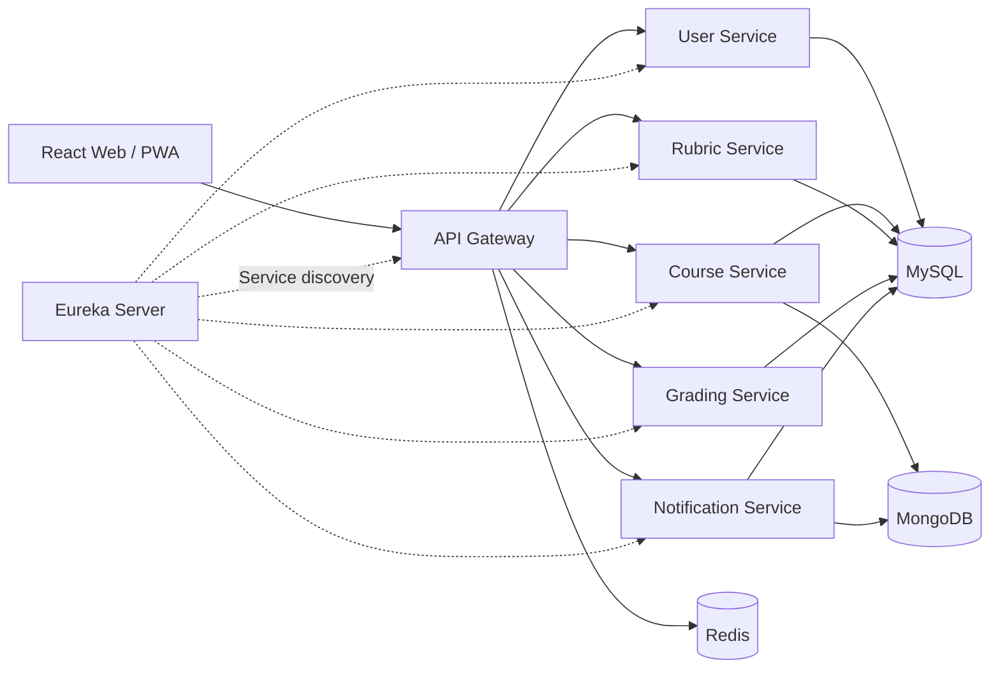

# LMS Rubric — Hệ thống quản lý học tập và đánh giá theo chuẩn đầu ra

> Sản phẩm khóa luận tốt nghiệp về thiết kế và xây dựng hệ thống quản lý học tập, tích hợp Rubric và mô hình giáo dục dựa trên chuẩn đầu ra (Outcome-Based Education — OBE).

## Thông tin khóa luận

| Nội dung | Thông tin |
|---|---|
| Loại hình | Khóa luận tốt nghiệp ngành Công nghệ thông tin |
| Lĩnh vực | Hệ thống quản lý học tập, đánh giá theo Rubric và OBE |
| Kiến trúc | Microservices |
| Kết quả đánh giá | **8.6/10** |
| Trạng thái | Đã hoàn thành và bảo vệ |

## Tóm tắt

Trong giáo dục đại học, việc tổ chức học liệu, quản lý hoạt động dạy–học và đánh giá mức độ đạt chuẩn đầu ra thường được thực hiện trên nhiều công cụ riêng biệt. Điều này làm giảm tính nhất quán của dữ liệu, gây khó khăn cho quá trình theo dõi tiến độ học tập và hạn chế khả năng phân tích kết quả theo chuẩn đầu ra học phần.

LMS Rubric được xây dựng nhằm cung cấp một nền tảng thống nhất cho quản lý học phần, tổ chức hoạt động học tập, thiết kế Rubric, chấm điểm và phân tích kết quả OBE. Hệ thống áp dụng kiến trúc microservices để phân tách các miền nghiệp vụ, hỗ trợ mở rộng độc lập và giảm mức độ phụ thuộc giữa các thành phần.

Kết quả của khóa luận là một hệ thống web full-stack có khả năng phục vụ nhiều vai trò, gồm quản trị viên, giảng viên, sinh viên, trợ giảng và cán bộ quản lý chuyên môn. Sản phẩm đã được đánh giá với kết quả **8.6/10**.

## Mục tiêu

- Xây dựng hệ thống quản lý học tập có cấu trúc nghiệp vụ phù hợp với môi trường đại học.
- Chuẩn hóa hoạt động đánh giá bằng Rubric gồm tiêu chí, mức đánh giá, mô tả và trọng số.
- Liên kết kết quả đánh giá với CLO/PLO để hỗ trợ theo dõi mức độ đạt chuẩn đầu ra.
- Hỗ trợ quy trình tạo, hiệu chỉnh, gửi duyệt, phê duyệt và quản lý phiên bản Rubric.
- Tách biệt các miền nghiệp vụ theo kiến trúc microservices nhằm tăng khả năng bảo trì và mở rộng.
- Đảm bảo xác thực, phân quyền và trao đổi dữ liệu nhất quán giữa các dịch vụ.

## Đóng góp chính

1. **Mô hình hóa đánh giá theo Rubric:** biểu diễn Rubric theo cấu trúc nhiều cấp gồm tiêu chí, mức đánh giá, mô tả mức và trọng số; hỗ trợ kiểm tra tổng trọng số và mức độ bao phủ CLO.
2. **Tích hợp OBE:** quản lý CLO/PLO, ánh xạ chuẩn đầu ra và tổng hợp kết quả học tập để phục vụ phân tích mức độ đáp ứng chuẩn đầu ra.
3. **Quản lý vòng đời Rubric:** hỗ trợ Rubric cấp khoa, biến thể của giảng viên, tạo phiên bản, gửi duyệt, phê duyệt hoặc từ chối và chuyển đổi phiên bản hiện hành.
4. **Số hóa hoạt động học tập:** quản lý học phần, bài tập, ngân hàng câu hỏi, bài kiểm tra, nộp bài, chấm điểm, sổ điểm, nhóm học tập và trao đổi học thuật.
5. **Hỗ trợ điểm danh và chống gian lận:** kết hợp phiên điểm danh, mã QR và dữ liệu vị trí để kiểm tra điều kiện tham gia.
6. **Kiến trúc phân tán:** phân tách hệ thống thành các dịch vụ độc lập, giao tiếp qua REST/OpenFeign và được định tuyến tập trung qua API Gateway.

## Kiến trúc hệ thống



### Phân rã dịch vụ

| Thành phần | Trách nhiệm chính | Cổng mặc định |
|---|---|---:|
| `api-gateway` | Điểm truy cập tập trung, định tuyến và kiểm tra JWT | 8080 |
| `eureka-server` | Đăng ký và khám phá dịch vụ | 8761 |
| `user-service` | Người dùng, vai trò, hồ sơ, xác thực và OAuth2 | 8081 |
| `course-service` | Học phần, lớp học, bài tập, thi, điểm danh và OBE | 8082 |
| `rubric-service` | CLO, Rubric, ma trận Rubric và quản lý phiên bản | 8083 |
| `notification-service` | Thông báo và giao tiếp thời gian thực | 8084 |
| `grading-service` | Chấm điểm theo Rubric và quản lý kết quả đánh giá | 8085 |
| `front-end` | Giao diện web đa vai trò và PWA | 5173 |

## Chức năng tiêu biểu

### Quản lý người dùng và truy cập

- Đăng ký, đăng nhập, làm mới token và khôi phục mật khẩu qua OTP.
- Xác thực bằng JWT và đăng nhập Google OAuth2.
- Quản lý hồ sơ sinh viên, giảng viên, khoa và bộ môn.
- Phân quyền giao diện và API theo vai trò người dùng.

### Quản lý đào tạo

- Quản lý học phần, lớp học phần, đề cương và lịch học.
- Phân công giảng viên, trợ giảng và ghi danh sinh viên.
- Quản lý bài đăng, chủ đề thảo luận, bình luận và nhóm học tập.
- Quản lý bài tập, bài kiểm tra, ngân hàng câu hỏi và quá trình nộp bài.

### Rubric và đánh giá OBE

- Tạo Rubric với tiêu chí, mức đánh giá, mô tả và trọng số.
- Liên kết tiêu chí Rubric với chuẩn đầu ra học phần (CLO).
- Tạo biến thể và phiên bản Rubric mà không làm mất lịch sử chuyên môn.
- Thực hiện quy trình gửi duyệt, phê duyệt, từ chối và chọn phiên bản hiện hành.
- Chấm điểm theo từng tiêu chí và tổng hợp kết quả vào sổ điểm.
- Phân tích mức độ đạt CLO/PLO theo lớp học phần.

### Tương tác và giám sát

- Thông báo theo thời gian thực thông qua WebSocket/STOMP.
- Điểm danh bằng QR kết hợp kiểm tra vị trí GPS.
- Dashboard và báo cáo phục vụ sinh viên, giảng viên và cán bộ quản lý.
- Nhật ký hệ thống hỗ trợ theo dõi các thao tác nghiệp vụ quan trọng.

## Công nghệ sử dụng

| Lớp hệ thống | Công nghệ |
|---|---|
| Frontend | React 19, TypeScript, Vite, Tailwind CSS, Redux Toolkit |
| Backend | Java 21, Spring Boot, Spring Security, Spring Data JPA |
| Hạ tầng dịch vụ | Spring Cloud Gateway, Eureka, OpenFeign |
| Dữ liệu | MySQL, MongoDB, Redis |
| Giao tiếp | REST API, WebSocket, STOMP |
| Bảo mật | JWT, OAuth2, phân quyền theo vai trò |
| Báo cáo và dữ liệu | Chart.js, Recharts, Apache POI, jsPDF, XLSX |
| Đóng gói | Maven, npm, Dockerfile, Docker Compose |
| Mô hình hóa | UML, PlantUML |

## Một số kỹ thuật xử lý nghiệp vụ

- Tính tổng trọng số tiêu chí Rubric với độ phức tạp tuyến tính theo số tiêu chí.
- Loại trùng và thống kê CLO được bao phủ trong từng Rubric.
- Sắp xếp các mức đánh giá theo điểm và tên mức để đảm bảo hiển thị nhất quán.
- Đồng bộ ma trận Rubric trong transaction nhằm duy trì tính toàn vẹn dữ liệu.
- Sử dụng JPA EntityGraph để hạn chế vấn đề truy vấn N+1 khi tải tiêu chí và mức đánh giá.
- Quản lý trạng thái và lịch sử phiên bản để bảo toàn khả năng truy vết thay đổi.
- Tổng hợp kết quả chấm điểm theo CLO, phục vụ phân tích mức độ đạt chuẩn đầu ra.

## Cấu trúc mã nguồn

```text
LMS_rubric/
├── api-gateway/           # Định tuyến và xác thực tập trung
├── eureka-server/         # Service discovery
├── user-service/          # Người dùng và xác thực
├── course-service/        # Học phần và hoạt động học tập
├── rubric-service/        # Rubric, CLO và phiên bản
├── grading-service/       # Chấm điểm và kết quả
├── notification-service/  # Thông báo thời gian thực
├── front-end/             # Ứng dụng React/TypeScript
├── docs/                  # Sơ đồ và tài liệu mô hình hóa
├── scripts/               # Tiện ích tạo sơ đồ và xử lý dữ liệu
└── compose.yaml           # Cấu hình triển khai các thành phần
```

## Yêu cầu môi trường

- Java Development Kit 21
- Node.js 20 trở lên và npm
- MySQL/MariaDB
- MongoDB
- Redis
- Maven Wrapper đi kèm từng dịch vụ

## Khởi chạy ở môi trường phát triển

### 1. Cấu hình biến môi trường

Các giá trị nhạy cảm không được lưu trong repository. Trước khi chạy hệ thống, cần thiết lập tối thiểu các biến sau trong môi trường cục bộ:

```text
DB_USERNAME
DB_PASSWORD
JWT_SECRET
GOOGLE_CLIENT_ID
GOOGLE_CLIENT_SECRET
CLOUDINARY_CLOUD_NAME
CLOUDINARY_API_KEY
CLOUDINARY_API_SECRET
```

Các tích hợp Google và Cloudinary là tùy chọn nếu chức năng tương ứng không được sử dụng. Không commit khóa truy cập hoặc mật khẩu thật vào Git.

### 2. Khởi chạy các dịch vụ backend

Khởi động `eureka-server` trước, sau đó lần lượt chạy các dịch vụ nghiệp vụ và `api-gateway`.

Trên Windows:

```powershell
cd eureka-server/eureka-server
./mvnw.cmd spring-boot:run
```

Trên Linux/macOS:

```bash
cd eureka-server/eureka-server
./mvnw spring-boot:run
```

Thực hiện tương tự trong thư mục của `user-service`, `course-service`, `rubric-service`, `grading-service`, `notification-service` và `api-gateway`.

### 3. Khởi chạy frontend

```bash
npm install
cd front-end
npm install
npm run dev
```

Ứng dụng phát triển mặc định được cung cấp tại `http://localhost:5173` và gửi yêu cầu API qua Gateway tại `http://localhost:8080`.

## Kiểm tra chất lượng

```bash
cd front-end
npm run build
npm run lint
```

Đối với từng dịch vụ Spring Boot:

```bash
./mvnw test
```

## Kết quả và hướng phát triển

Khóa luận đã hoàn thành các luồng nghiệp vụ trọng tâm của một LMS tích hợp đánh giá theo Rubric và OBE, đồng thời chứng minh khả năng tổ chức hệ thống theo kiến trúc microservices. Kết quả bảo vệ đạt **8.6/10**, phản ánh mức độ hoàn thiện tốt về nghiệp vụ, thiết kế và triển khai sản phẩm.

Các hướng phát triển tiếp theo gồm:

- Mở rộng kiểm thử tự động ở cấp đơn vị, tích hợp và end-to-end.
- Chuẩn hóa quan sát hệ thống bằng centralized logging, metrics và distributed tracing.
- Hoàn thiện CI/CD và chiến lược triển khai trên môi trường cloud.
- Tối ưu kích thước bundle frontend và phân tách tải theo chức năng.
- Bổ sung phân tích dữ liệu học tập theo thời gian và cảnh báo sớm cho người học.
- Tăng cường quản trị bí mật bằng secret manager chuyên dụng.

## Phạm vi sử dụng

Repository được công bố với mục đích giới thiệu kết quả học tập, năng lực phân tích–thiết kế hệ thống và năng lực phát triển phần mềm full-stack trong khuôn khổ khóa luận tốt nghiệp.
