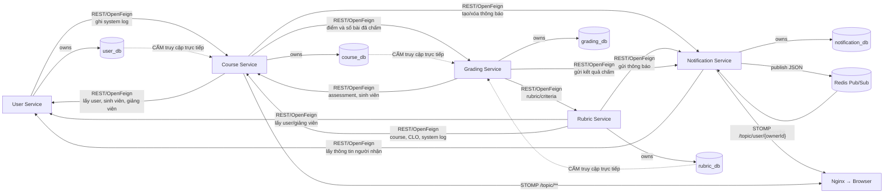

# KIẾN TRÚC MỤC TIÊU: 5 SERVICE – 5 DATABASE

> Đây là kiến trúc mục tiêu khi tách dữ liệu. Nó chưa phải cấu hình đang chạy
> trong `compose.yaml` hiện tại. Mỗi service sở hữu duy nhất database của mình;
> service khác phải gọi API hoặc nhận event, không được truy vấn chéo database.

## 1. Sơ đồ triển khai tổng thể

```mermaid
flowchart TB
    CLIENT["Người dùng<br/>Web browser"]

    subgraph SERVER["Ubuntu Server - 192.168.181.134"]
        direction TB
        PUBLIC["Public endpoint<br/>192.168.181.134:80<br/>hoặc :443 khi có TLS"]

        subgraph COMPOSE["Docker Compose"]
            direction TB

            subgraph NETWORK["Docker bridge network: lms-network"]
                direction TB

                NGINX["front-end container<br/>React static files + Nginx :80<br/>container duy nhất publish ra host"]
                GATEWAY["api-gateway :8080<br/>JWT filter + routing"]
                EUREKA["eureka-server :8761<br/>Service discovery"]

                subgraph APPLICATION["Application layer - Java 21 containers"]
                    direction LR
                    USER["user-service :8081<br/>Tài khoản, hồ sơ,<br/>JWT, OAuth2"]
                    COURSE["course-service :8082<br/>Khóa học, lớp học phần,<br/>bài tập, chat"]
                    RUBRIC["rubric-service :8083<br/>Rubric, tiêu chí,<br/>mức đánh giá, CLO"]
                    NOTIFY["notification-service :8084<br/>Thông báo, email,<br/>WebSocket"]
                    GRADING["grading-service :8085<br/>Điểm, feedback,<br/>rubric result"]
                end

                subgraph OWNED_DATABASES["Database per Service - không publish ra host"]
                    direction LR
                    USERDB[("user-db :3306<br/>user_db")]
                    COURSEDB[("course-db :3306<br/>course_db")]
                    RUBRICDB[("rubric-db :3306<br/>rubric_db")]
                    NOTIFYDB[("notification-db :3306<br/>notification_db")]
                    GRADINGDB[("grading-db :3306<br/>grading_db")]
                end

                subgraph SUPPORT_DATA["Kho dữ liệu hỗ trợ - không thay thế DB nghiệp vụ"]
                    direction LR
                    MONGO[("MongoDB :27017<br/>nội dung phi quan hệ<br/>của Course Service")]
                    REDIS[("Redis :6379<br/>notification Pub/Sub<br/>và cache nếu cần")]
                end
            end

            subgraph VOLUMES["Named volumes"]
                direction LR
                UV[("user-db-data")]
                CV[("course-db-data")]
                RV[("rubric-db-data")]
                NV[("notification-db-data")]
                GV[("grading-db-data")]
                MV[("mongo-data")]
                RDV[("redis-data")]
            end
        end
    end

    GOOGLE["Google OAuth2"]
    SMTP["Gmail SMTP :587"]
    CLOUDINARY["Cloudinary"]
    S3["AWS S3"]

    CLIENT -->|"HTTP/HTTPS"| PUBLIC
    PUBLIC --> NGINX
    NGINX -->|"/api/**"| GATEWAY
    NGINX -->|"/oauth2/**"| USER
    NGINX -->|"/ws - SockJS/STOMP"| COURSE
    NGINX -->|"/ws-notifications - SockJS/STOMP"| NOTIFY

    GATEWAY -->|"lb://USER-SERVICE"| USER
    GATEWAY -->|"lb://COURSE-SERVICE"| COURSE
    GATEWAY -->|"lb://RUBRIC-SERVICE"| RUBRIC
    GATEWAY -->|"lb://NOTIFICATION-SERVICE"| NOTIFY
    GATEWAY -->|"lb://GRADING-SERVICE"| GRADING

    GATEWAY -.->|"fetch registry"| EUREKA
    USER -.->|"register/fetch"| EUREKA
    COURSE -.->|"register/fetch"| EUREKA
    RUBRIC -.->|"register/fetch"| EUREKA
    NOTIFY -.->|"register/fetch"| EUREKA
    GRADING -.->|"register/fetch"| EUREKA

    USER -->|"JDBC; độc quyền đọc/ghi"| USERDB
    COURSE -->|"JDBC; độc quyền đọc/ghi"| COURSEDB
    RUBRIC -->|"JDBC; độc quyền đọc/ghi"| RUBRICDB
    NOTIFY -->|"JDBC; độc quyền đọc/ghi"| NOTIFYDB
    GRADING -->|"JDBC; độc quyền đọc/ghi"| GRADINGDB

    COURSE -->|"Spring Data MongoDB"| MONGO
    NOTIFY <-->|"Pub/Sub: notification-channel"| REDIS

    USERDB --- UV
    COURSEDB --- CV
    RUBRICDB --- RV
    NOTIFYDB --- NV
    GRADINGDB --- GV
    MONGO --- MV
    REDIS --- RDV

    USER -->|"OAuth2"| GOOGLE
    USER -->|"OTP email"| SMTP
    NOTIFY -->|"notification email"| SMTP
    USER -->|"avatar"| CLOUDINARY
    COURSE -->|"file/bài nộp"| S3
```



## 2. Giao tiếp giữa 5 service



## 3. Quyền sở hữu dữ liệu

| Service | Database riêng | Dữ liệu thuộc quyền sở hữu | Dữ liệu ngoài service chỉ lưu dạng ID |
|---|---|---|---|
| User Service | `user_db` | User, sinh viên, giảng viên, khoa, bộ môn, refresh/auth data | Không cần sao chép dữ liệu khóa học |
| Course Service | `course_db` | Course, offering, enrollment, assessment, submission, attendance, conversation | `student_id`, `lecturer_id`, `rubric_id` |
| Rubric Service | `rubric_db` | Rubric, criteria, level, CLO và mapping thuộc rubric | `course_id`, `lecturer_id` |
| Grading Service | `grading_db` | Grade, feedback template, rubric result | `student_id`, `assessment_id`, `rubric_id` |
| Notification Service | `notification_db` | Notification, trạng thái đọc, resource liên kết | `sender_id`, `owner_id`, `linked_resource_id` |

Các ID liên-service là **tham chiếu logic**, không tạo foreign key xuyên database.
Muốn kiểm tra hoặc lấy thông tin đầy đủ phải gọi service sở hữu dữ liệu.

## 4. Cách đóng gói database

Sơ đồ trên thể hiện mức cô lập mạnh nhất: năm container MariaDB và năm named
volume. Tên kết nối nội bộ dự kiến:

```text
user-service         → jdbc:mysql://user-db:3306/user_db
course-service       → jdbc:mysql://course-db:3306/course_db
rubric-service       → jdbc:mysql://rubric-db:3306/rubric_db
notification-service → jdbc:mysql://notification-db:3306/notification_db
grading-service      → jdbc:mysql://grading-db:3306/grading_db
```

Nếu máy Ubuntu chưa đủ RAM, vẫn có thể dùng **một MariaDB container chứa năm
schema và năm tài khoản riêng**. Quan hệ sở hữu dữ liệu trên sơ đồ không đổi;
chỉ thay đổi cách triển khai vật lý. Tuyệt đối không cấp cho một service quyền
đọc schema của service khác.

## 5. IP và cổng sau khi tách database

- FE và năm backend vẫn chạy chung máy `192.168.181.134`.
- Chỉ Nginx publish `80:80` (và có thể `443:443` sau khi cấu hình TLS).
- Gateway, Eureka, backend và năm database chỉ tồn tại trong `lms-network`.
- Không publish `3306` của bất kỳ database nào ra ngoài Ubuntu.
- Việc tách database không làm đổi URL người dùng: `http://192.168.181.134`.

## 6. Yêu cầu trước khi chuyển đổi

1. Phân loại toàn bộ bảng hiện tại về đúng service sở hữu.
2. Gỡ entity/repository đang đọc bảng của service khác.
3. Thay JOIN hoặc foreign key xuyên service bằng API batch, cache hoặc event.
4. Mỗi service có tài khoản DB, migration Flyway/Liquibase và lịch backup riêng.
5. Với thao tác liên quan nhiều service, dùng eventual consistency; không mở
   transaction ACID xuyên năm database.
6. Luồng quan trọng cần retry/outbox; khi quy mô tăng có thể bổ sung RabbitMQ
   hoặc Kafka thay cho việc phụ thuộc hoàn toàn vào REST đồng bộ.
