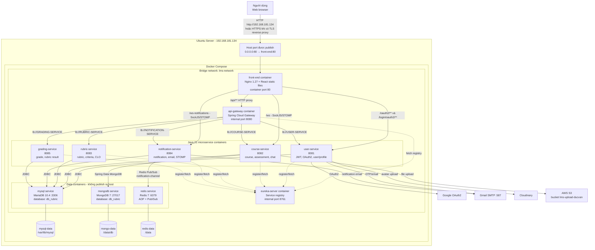
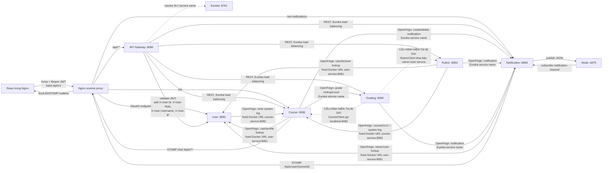

# KIẾN TRÚC TRIỂN KHAI LMS RUBRIC

> Bản này mô tả cấu hình hiện tại dùng chung `db_rubric`. Kiến trúc mục tiêu
> tách năm database nằm tại
> [`ARCHITECTURE_5_DATABASES.md`](./ARCHITECTURE_5_DATABASES.md).

Tài liệu này vẽ lại `architecture_ver1.pdf` theo cấu hình đang có trong
`compose.yaml`, các `Dockerfile`, `front-end/nginx.conf` và mã nguồn các
Feign client. Sơ đồ dùng Mermaid, không chèn ảnh, có thể chỉnh sửa trực tiếp.

## 1. Kiến trúc triển khai trên Ubuntu

## 2. Giao tiếp giữa các service

## 3. Đóng gói và đường đi của request

| Thành phần | Cách đóng gói | Cách truy cập khi deploy |
|---|---|---|
| Front-end | Multi-stage: `node:22-alpine` chạy `npm ci` + `npm run build:docker`; thư mục `dist` được copy sang `nginx:1.27-alpine` | Chỉ container này publish `${APP_PORT:-80}:80`; người dùng mở `http://192.168.181.134` |
| API Gateway | Multi-stage Maven 3.9/Temurin 21; chạy `app.jar` trên `eclipse-temurin:21-jre` | Chỉ Nginx và container trong `lms-network` gọi `api-gateway:8080` |
| 5 backend service | Mỗi service là một image/container độc lập; Maven build JAR, JRE 21 chạy JAR | Giao tiếp nội bộ bằng Docker DNS (`user-service`, `course-service`,...) và/hoặc Eureka |
| Eureka | Image Java riêng | Chỉ nội bộ tại `eureka-server:8761` |
| MariaDB, MongoDB, Redis | Image chính thức; dữ liệu tách khỏi container bằng named volume | Chỉ nội bộ; không có ánh xạ `ports` ra Ubuntu |

Luồng REST chuẩn:

1. Browser gửi request tới `192.168.181.134:80` cùng Bearer JWT.
2. Nginx nhận `/api/**` và proxy tới `api-gateway:8080` bằng Docker DNS.
3. Gateway kiểm tra JWT, bổ sung các header định danh người dùng.
4. Gateway hỏi Eureka để định tuyến `lb://...` tới đúng service.
5. Service xử lý nghiệp vụ, gọi service khác bằng OpenFeign khi cần và đọc/ghi data store.
6. Response quay lại qua Gateway → Nginx → Browser.

Luồng realtime không đi qua Gateway: Nginx proxy `/ws` thẳng tới
`course-service:8082` và `/ws-notifications` thẳng tới
`notification-service:8084`.

## 4. FE và BE có deploy chung IP không?

**Có, nếu chạy đúng `compose.yaml` hiện tại:** FE, Gateway, backend và data store
đều chạy trên cùng máy Ubuntu có IP vật lý `192.168.181.134`.

Tuy nhiên cần phân biệt:

- Chỉ FE/Nginx dùng IP host và port public: `192.168.181.134:80`.
- Backend không publish port `8080`–`8085` ra host, nên máy ngoài không gọi trực
  tiếp `192.168.181.134:8080`.
- Mỗi container có IP nội bộ riêng, có thể thay đổi. Các container gọi nhau bằng
  tên service Docker, không dùng IP container cố định.
- Với browser, FE và API có cùng origin. Biến build `VITE_API_BASE=/api/v1`
  khiến Axios gọi URL tương đối; Nginx chuyển tiếp request vào Gateway.

## 5. Chênh lệch giữa PDF và cấu hình thật cần lưu ý

1. PDF ghi Grading `8084` và Notification `8085`; mã nguồn/Dockerfile thực tế là
   Notification `8084`, Grading `8085`.
2. PDF chỉ thể hiện MySQL/Redis. Compose thực tế còn có MongoDB cho
   `course-service`, Eureka, Nginx reverse proxy và các named volume.
3. `grading-service` có hai cấu hình liên-service chưa chạy đúng trong Docker:
   `CourseClient` hard-code `localhost:8082`, còn `RubricClient` khai báo nhầm
   `name = "user-service"`.
4. `notification-service` đọc `${URL_FRONTEND}` trong `WebSocketConfig`, nhưng
   `compose.yaml` chưa truyền biến này. Container có thể không khởi động nếu
   không có nguồn cấu hình khác cung cấp giá trị.
5. Trong một file FE còn URL `localhost` hard-code ở trang tạo assignment; các
   luồng đó sẽ không gọi được server Ubuntu từ máy người dùng nếu được sử dụng.
